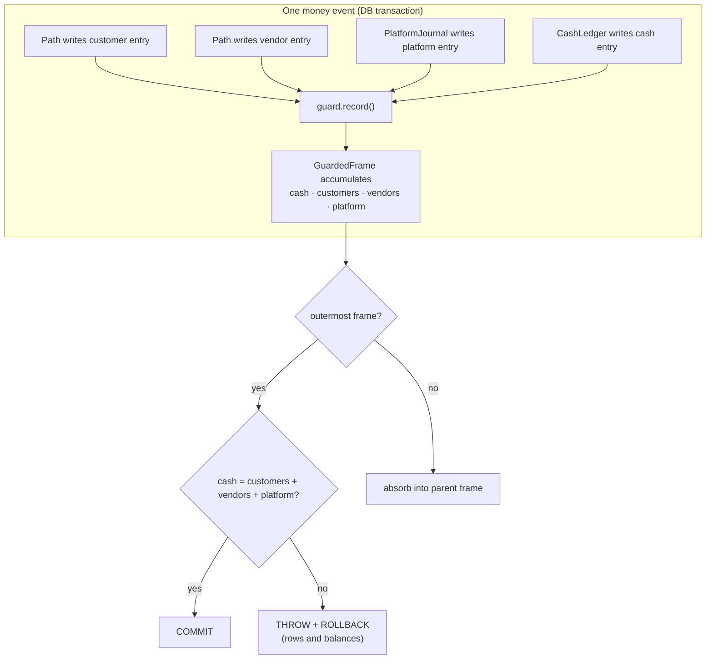

# Case 01 — Money integrity

**A ledger that refuses to persist an unbalanced transaction, then audits the
whole ledger from the outside.**

`PHP 8.3` · `Laravel` · `Eloquent` · `PHPUnit` · transaction-scoped invariants

---

## The problem

A marketplace moves money between three parties: **customers**, **vendors**, and
the **platform** itself. Cash sits in a gateway or a bank account and is *owed*
to one of those three. Every payment, refund, settlement, reward, and correction
is a set of movements across four balances:

```
cash  =  customer wallets  +  vendor wallets  +  platform wallet
```

When that identity breaks, nothing crashes. The numbers just stop adding up —
often by a few cents at a time — and nobody notices until a reconciliation
report is wrong weeks later, at which point the original cause is gone and only
the symptom remains.

The usual answer is a separate double-entry journal written by hand for every
path. That works, but it is a second system to keep in sync, and it fails the
same way: a path that forgets to write its journal can't be caught until the
report runs.

**The constraint:** the invariant must be enforced *where the writes happen*,
and it must be impossible to bypass by accident.

## The approach

Every money-moving code path runs inside a `LedgerGuard::transaction()`. The
guard opens a frame, watches the rows being written, and — only when the
outermost frame is about to commit — asserts the identity. If it does not hold,
the exception unwinds the whole transaction: rows *and* balances together.



A second, independent job — **`LedgerAudit`** — reads the *real* datastore and
checks six invariants from the outside: the identity, the platform's balance
chain, its unearned-versus-unsettled-commission reconciliation, each paid order's
four sides, every cash movement's twin entry, and zero/ inconsistent rows. It
writes each run down as a snapshot so two runs can be compared.

Enforcement stops new faults; the audit catches the old ones and the ones that
slipped through a declared exemption.

## The interesting part

### 1. The guard judges on commit, and only the outermost frame judges

The check is not a validation call a developer remembers to make — it is the
transaction boundary itself. Nested events absorb into their parent, because an
inner service may legitimately write one side and let the caller finish the
other.

```php
self::pop();

if ($parent === null) {
    // Only the outermost frame commits, so only it judges.
    if (! $frame->exempt) {
        $frame->assertBalanced();
    }
} elseif (! $frame->exempt) {
    // An inner frame may leave one side for its caller to complete.
    $parent->absorb($frame);
}
```

The totals are summed from the rows seen *in this very transaction*, so the
check costs no query:

```php
public function assertBalanced(): void
{
    $gap = round($this->cash - ($this->customers + $this->vendors + $this->platform), 2);

    if (abs($gap) > self::TOLERANCE) {
        throw new UnbalancedLedgerException(/* names every side and the gap */);
    }
}
```

### 2. The only escapes must declare themselves

Three writers are legitimately allowed through unbalanced: a manual correction,
a reconciliation, and a one-time backfill. They must pass a reason, and that
reason is stamped on **every row** they write. A row that broke the identity on
purpose can therefore always be told apart from one that broke it by accident.

### 3. The platform's wallet is written by exactly one class

`PlatformJournal` is the single writer of the platform's own rows. It is called
*inside* the path's guard, after the customer's and vendor's rows, so the
platform wallet is always the last locked — a fixed lock order that prevents
deadlocks:

> order → vendor → customer → platform

Every amount it posts is read off what the path actually wrote, never
recomputed:

```php
// What became earned at completion is the commission still open on this
// order's own rows — not a number derived from a parallel pricing formula.
$this->post($order, LedgerOperation::CommissionEarned, 'credit',
    $this->unsettledCommission($order), movesEarned: true, movesBalance: false,
    key: 'Commission on order #:id became earned');
```

That one detail is why a commission can never "disagree with itself" after a
price change: the ledger is the source of truth, and the code reads it back.

## Tradeoffs

- **The balance check is not free on every write.** The guard does one small
  read per row to resolve a wallet's owner. I chose that over a per-request memo
  because the memo is wrong the day a wallet id is reused under a new owner.
- **A single platform wallet serialises the platform's writes.** For this
  project's volume that is far from a bottleneck; the design note says to shard
  by day if it ever bites. Correctness first, and the escape hatch named.
- **A separate journal would be more "standard".** But it is a second source of
  truth to keep aligned, and the failure mode — a path that forgets to write it
  — is exactly the silent drift this design exists to prevent.
- **Legacy history is replayed through an explicit `asLegacyHistory()` hook.**
  The backfill has to start from what the database already holds, so it runs
  without the platform side and without judgement — deliberately, and visibly.

## Testing

Tests describe the *behaviour of the guard*, not the implementation. The two
that matter most:

```php
public function test_an_unbalanced_event_rolls_back_the_row_and_the_balance(): void
{
    $wallet = $this->customer->wallet();

    try {
        LedgerGuard::transaction(function () use ($wallet): void {
            $balances = $wallet->add(100);
            LedgerEntry::create([/* credit 100, no cash behind it */]);
        });
        $this->fail('An unbalanced event was committed.');
    } catch (UnbalancedLedgerException $e) {
        $this->assertStringContainsString('100', $e->getMessage());
    }

    $this->assertSame(0, LedgerEntry::count());
    $this->assertSame('0.00', (string) $wallet->fresh()->balance); // rolled back too
}
```

```php
public function test_nested_events_are_summed_and_judged_at_the_outermost(): void
{
    LedgerGuard::transaction(function () use ($wallet): void {
        $entry = LedgerGuard::transaction(function () use ($wallet) {
            // alone this would be refused...
            return LedgerEntry::create([/* credit 100 */]);
        });

        CashLedger::in(CashKind::BankTransfer, 100, entry: $entry); // ...the outer event completes it
    });

    $this->assertLedgerBalanced();
}
```

The suite also pins the negative cases: a row written outside any guard is
refused by the model, a thrown callback closes the frame, and a declared
exemption stamps its reason on every row.

- [`code/LedgerGuard.php`](code/LedgerGuard.php) — the guard and its frame stack
- [`code/GuardFrame.php`](code/GuardFrame.php) — the running totals and the assertion
- [`code/PlatformJournal.php`](code/PlatformJournal.php) — the single platform writer
- [`code/LedgerAudit.php`](code/LedgerAudit.php) — the independent verifier
- [`code/LedgerGuardTest.php`](code/LedgerGuardTest.php) — the behavioural suite

## What this demonstrates

- Translating a business invariant into an **enforced, non-bypassable
  constraint** rather than a convention.
- Understanding that **enforcement and verification are two different jobs**,
  and building both.
- **Concurrency discipline**: a fixed lock order, balances and rows rolled back
  together, side effects deferred to `afterCommit`.
- Designing the **escape hatch explicitly** (declared exemptions, a replay
  mode) instead of leaving a silent bypass.
- Writing **tests around behaviour and edge cases**, not around the code's
  structure.
