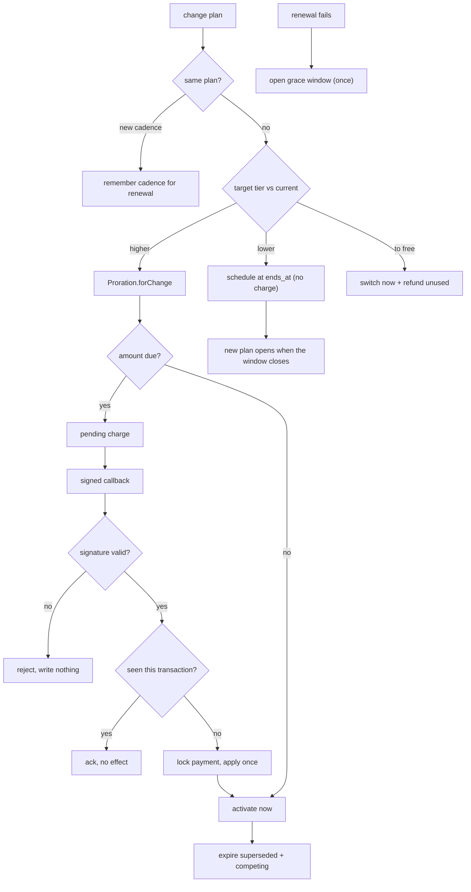

# Case 02 — Billing lifecycle

**A subscription that charges the prorated difference when a plan changes
mid-cycle, and applies each signed payment callback exactly once.**

`PHP 8.3` · `Laravel` · `Eloquent` · `Carbon` · `PHPUnit` · proration, grace
periods, signed idempotent webhooks

---

## The problem

A SaaS product sells seats on a few plans, monthly or yearly. Customers change
their minds constantly, and the naive move is wrong in a different way:

- **Charge the full new price** and they pay twice for the same days;
  **ignore the unused time** and the business eats it.
- **Activate on request** and an unpaid upgrade gives away premium; **wait for
  payment** and a fully-credited change — one covered entirely by the old plan
  — never activates, because no gateway processes a zero-dollar charge.
- **Trust the callback** and anyone reaching the endpoint can buy a plan with a
  forged body; **apply it as it arrives** and the gateway's retries bill twice.

None of these crash; each quietly produces a wrong number or a wrong state.

**The constraint:** every path that changes what someone is entitled to must
agree with every other path, including the one an external callback triggers —
which may arrive more than once.

## The approach

A plan change is resolved in one place — **`PlanChangeService`** — which decides
the direction, values the old plan, and either activates at once (an upgrade,
once paid) or schedules for later (a downgrade, never charged).
**`GatewayWebhook`** is the only thing that marks a payment settled, and it
verifies, claims, then transitions.



Two value objects carry the arithmetic: **`CoverageWindow`** owns the span a
subscription covers; **`Proration`** turns a change into the numbers a caller
needs (time left, credit, difference, amount due, refund due).

## The interesting part

### 1. Proration is measured against the window already paid for

The credit being valued is time already bought, so the window is the old
subscription's. The old plan is priced in the cycle it was sold on — the detail
easy to miss when the cadence changes too:

```php
// Valued in the cycle it was sold on, not the target's.
$sourcePrice  = $source->priceFor($current->billing_cycle);
$unusedCredit = round(($sourcePrice / $window->coveredDays()) * $window->remainingDays($at), 2);
$amountDue    = max(0.0, $target->priceFor($targetCycle) - $unusedCredit);
```

Credit that outruns the target is refunded rather than carried as a negative
charge; a move to free refunds everything left. The branches are explicit and
tested, because "which one did we land in" becomes a finance question later.

### 2. Upgrades and downgrades move in opposite directions

A downgrade is never paid for, so it is scheduled to open when the current paid
window closes; an upgrade opens now but is only *entitled* on settlement. The
settled payment retires the plan it supersedes, so nobody loses features they
already paid for while a charge is pending:

```php
// A second downgrade replaces the first rather than stacking two futures.
$this->cancelScheduled($account);
Subscription::create([
    'state'     => SubscriptionState::Pending,
    'starts_at' => $current->ends_at,
    'ends_at'   => $current->ends_at->addMonths($cycle->months()),
]);

// The upgrade opens now, but only settlement entitles it.
$subscription = $this->open($account, $target, $cycle, CarbonImmutable::now());
$subscription->forceFill(['supersedes_subscription_id' => $current->id])->save();
$payment = $this->payments->recordPlanChange($subscription, $current, $proration);
if ($payment->state === PaymentState::Settled) { $this->settlePayment($payment); }
```

A drop to free is the one downgrade handled immediately, because there is no
future invoice to move it into; the unused time is refunded in cash.

### 3. The callback is verified, claimed, then applied

The signature is computed over the gateway's fields in its exact order (the
order is protocol), then compared in constant time:

```php
$joined   = implode('', array_map(fn ($f) => (string) ($payload[$f] ?? ''), self::SIGNED_FIELDS));
$expected = hash_hmac('sha256', $joined, $this->signingKey);

return hash_equals($expected, $signature); // never `===`
```

Only then does it read the payment, under a row lock. A terminal payment is
left alone; a repeat carrying a seen transaction id is a replay. Neither is an
error — the gateway retries until it sees success, so repeats must be cheap:

```php
if ($payment->state->isTerminal())                return $this->record($payment, $payload, 'ignored_terminal');
if ($this->alreadySeen($payment, $transactionId)) return $this->record($payment, $payload, 'ignored_replay');
```

The lock makes concurrency safe: two copies arriving together serialise on the
payment row, and the second finds a terminal state, not a second transition.

### 4. Grace is for renewals only, and it never widens

A failed first payment leaves the subscription pending; a failed renewal opens
a short window so a card can be fixed, and a second failure does not buy more
time:

```php
if ($subscription->inGracePeriod()) {
    return; // a second failure must not extend the first window
}

$subscription->forceFill(['grace_period_ends_at' => now()->addDays(self::GRACE_DAYS)])->save();
```

When the window closes, a settled payment clears it; otherwise the customer is
moved off the plan rather than left on one they are not paying for.

## Tradeoffs

- **Whole-day proration.** Minute-level precision looks fairer and makes every
  refund argument worse. Days are the unit finance already thinks in.
- **`addMonths` clips short months.** A window opened on the 31st rolls to a
  shorter month; that is the calendar answer, and why `CoverageWindow` owns the
  day count.
- **Settlement is eventually consistent.** The subscription stays pending until
  the callback lands; a reconciliation poll is the backstop if one is lost.
- **Grace is a fixed window, not a dunning ladder.** One extension, no retry
  sequence — chosen because it is the failure mode I can make boring.
- **Shared-secret HMAC**, not public-key signatures. Standard for this gateway
  class and fine in practice, but the secret is a single point of trust.

## Testing

The suite targets money and state, not the methods that compute them.

```php
public function test_an_upgrade_mid_cycle_credits_the_unused_time_before_charging(): void
{
    $this->travelTo($this->windowStart->addDays(6)); // 24 of 30 days left

    $proration = Proration::forChange(
        $this->subscription, $this->basic, $this->pro, BillingCycle::Monthly,
    );

    $this->assertSame(24.0, $proration->unusedCredit); // 30.00 / 30 * 24
    $this->assertSame(66.0, $proration->amountDue);    // 90.00 less credit
}
```

Around that, the suite pins the free-tier and surplus refunds, a downgrade that
schedules and costs nothing, an upgrade that keeps the old plan active until
settlement, a duplicate callback applied once, a forged signature that writes
nothing, and a grace window a second failure cannot extend.

- [`code/BillingCycle.php`](code/BillingCycle.php) — the monthly/yearly cadence
- [`code/CoverageWindow.php`](code/CoverageWindow.php) — the covered span and its day counts
- [`code/Proration.php`](code/Proration.php) — the change math and its edge cases
- [`code/PlanChangeService.php`](code/PlanChangeService.php) — upgrades, downgrades, activation, grace
- [`code/GatewayWebhook.php`](code/GatewayWebhook.php) — verify, claim, transition exactly once
- [`code/BillingLifecycleTest.php`](code/BillingLifecycleTest.php) — the behavioural suite

## What this demonstrates

- Turning a commercial rule (proration) into a **small value object with named
  edge cases** instead of arithmetic threaded through a service.
- **Idempotency as a design property**: signature verification, transaction
  dedupe, and a row lock, so duplicate callbacks are correct by construction.
- **Directional domain rules** — upgrade immediate, downgrade deferred, free
  switch refunded — encoded once and tested.
- **Concurrency discipline**: the account row is locked first for every plan
  decision, so two clicks cannot double-activate.
- **Honest tradeoffs** — day granularity, eventual consistency, a fixed grace —
  named rather than hidden.
