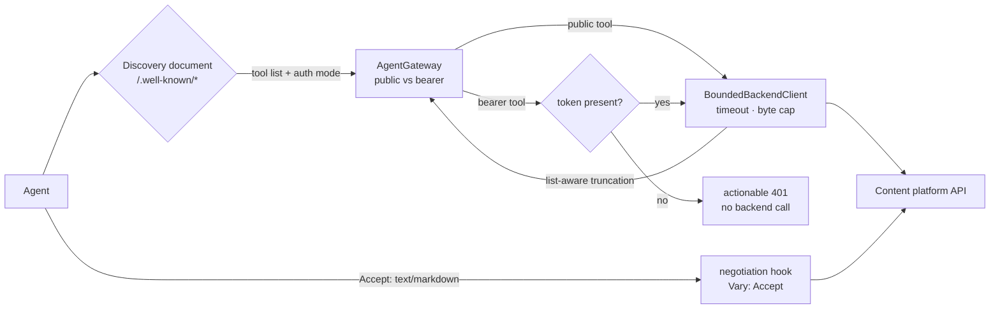

# Case 03 — Agent interface

**A tool server a model can discover, budget against, and call — where the only
credential in play is one a human chose to hand over.**

`TypeScript 5` · `Node (Nitro)` · MCP-style tool server · OAuth-flavoured discovery · `Accept` content negotiation

---

## The problem

A content platform wants AI agents to read it, and every naive way in is bad.
Scraping HTML makes the agent guess at structure that changes. A REST reference
invites it to invent URLs and pagination. A bespoke integration per assistant
forks the surface every time a new one ships.

Underneath sits a sharper constraint: some content is public, some is behind a
membership. An agent cannot log a human in, so delegation must be explicit — and
the line between "anyone may read this" and "only this account may" cannot be a
convention each handler remembers. It also cannot be unbounded: a model needs to
know what it is about to download *before* it asks.

**The constraint:** one discoverable surface, honest about which tools need a
token, with every response bounded in time and bytes.

## The approach

Four small pieces, each with one job:

- **`ToolRegistry`** declares the surface once — tool list, auth mode, the
  backend paths a tool may touch, and the input checks applied before a path is
  built.
- **`AgentGateway`** advertises the list and turns a call into exactly one
  bounded backend request.
- **`BoundedBackendClient`** owns the deadline, the byte budget, locale headers,
  and the mapping from backend status to a tool error.
- **`discovery.ts`** emits the well-known documents an agent reads first;
  **`markdown-negotiation.ts`** lets it ask for prose instead of markup.



## The interesting part

### 1. Auth is a property of the declaration, enforced in one place

The tool list is data, and one field of it is `auth`. The gateway reads that
field centrally, so a handler cannot forget it — and a new handler inherits the
check. Bearer-only tools are **hidden** from an unauthenticated list rather
than shown-and-refused, and the refusal is a tool error: no token means the
backend is never contacted.

```ts
private assertAuthorized(spec: ToolSpec): void {
  if (spec.auth === 'bearer' && !this.authenticated()) {
    throw new BackendError(`${spec.name} requires a platform bearer token…`, 401, 'unauthorized')
  }
}
```

### 2. Discovery describes the human hop instead of a fantasy flow

It is easy to emit a scanner-pleasing `agent_auth` block that implies an agent
can mint its own credentials. This one says the opposite, in the document
itself — a scanner that assumes automated assertion is worse than one that
reads the note.

```ts
registration_note:
  'A human opens claim_uri and completes the upstream sign-in. Only then may a client ' +
  'POST register_uri (with the browser session cookie) to obtain a platform token. ' +
  'Automated identity-assertion grants are not implemented.',
```

The issuer and the upstream identity provider stay in separate fields: the site
brokers credentials for its own API, and the provider is listed only so the
browser hop is discoverable.

### 3. The byte budget drops rows, not the envelope

JSON past the cap is truncated list-aware: trailing items fall off, the envelope
survives, and the agent learns how many existed — so it can page for the rest.

```ts
return {
  data: { ...root, result: {
    ...result, data: kept, truncated: true,
    returned: kept.length, original_count: result.data.length,
  } },
  truncated: true,
}
```

If even the envelope will not fit, the client returns a compact summary
explaining the limit rather than dribbling out bytes that would confuse a model.

### 4. Ids are interpolated into URLs, so they are constrained

Handlers build paths from caller input, so a conservative pattern keeps a caller
from smuggling a slash, a traversal segment, or a query into that path:

```ts
const ID_PATTERN = /^[A-Za-z0-9][A-Za-z0-9_-]{0,63}$/

export function assertSafeId(value: unknown): string {
  const id = typeof value === 'string' ? value.trim() : ''
  if (!ID_PATTERN.test(id)) throw new ToolInputError('id must be 1-64 characters …')
  return id
}
```

### 5. `Vary: Accept` is the whole negotiation contract

Serving Markdown is the easy half. The hard half is telling caches that one URL
now has two representations, or they hand Markdown to a browser and HTML to an
agent — whichever they cached first.

```ts
const existing = response.headers['vary']
response.headers['vary'] = existing ? `${existing}, Accept` : 'Accept'
response.headers['x-markdown-tokens'] = String(estimateTokens(markdown))
```

The token counters are a documented heuristic, not a tokenizer: they exist so an
agent can budget before downloading. If conversion throws, the HTML is served
untouched — a broken optimisation must not become a broken page.

## Tradeoffs

- **A hand-written hook instead of an edge feature.** Some CDNs negotiate
  Markdown at the edge. Origin-side works on any host and is unit-testable, at
  the cost of running the converter in the request path.
- **A heuristic token count.** Real tokenizers differ by model and language. The
  estimate is honest about being one and cheap enough to always compute; exact
  counts would mean shipping every tokenizer.
- **Allowlists over an open catalog.** Tools reach only declared collections and
  detail kinds — less flexible than a generic proxy, deliberately so: a generic
  fetch endpoint is an SSRF surface with a friendly name.
- **Stateless tools, human-brokered auth.** No session to expire, but the bearer
  token must be re-supplied per call and a human completes the login. That is
  the correct trade for delegated access.

## Testing

Tests target boundary behaviour, not handler bodies. Two that carry the design:

```ts
test('a bearer tool without a token never reaches the backend', async () => {
  const fetchSpy = vi.spyOn(globalThis, 'fetch')
  const gateway = new AgentGateway({ siteUrl, apiBaseUrl, accessToken: null })

  const result = await gateway.call('get_account', {})
  expect(result.error?.code).toBe('unauthorized')
  expect(fetchSpy).not.toHaveBeenCalled()   // fail closed, fail early
})
```

```ts
test('negotiation appends Accept without clobbering an existing Vary', () => {
  const response = { body: '<p>hi</p>', headers: { 'content-type': 'text/html', vary: 'Cookie' } }
  negotiateMarkdownResponse(response, 'text/markdown')

  expect(response.headers['vary']).toBe('Cookie, Accept')
  expect(response.headers['content-type']).toBe('text/markdown; charset=utf-8')
})
```

The suite also pins the negative cases: `assertSafeId` rejects `../` and empty
values, a non-HTML response is left alone, and a conversion failure serves the
original HTML.

- [`code/AgentGateway.ts`](code/AgentGateway.ts) — the tool server and dispatch
- [`code/ToolRegistry.ts`](code/ToolRegistry.ts) — the surface declaration and input guards
- [`code/BoundedBackendClient.ts`](code/BoundedBackendClient.ts) — the timeout/byte-bounded client
- [`code/discovery.ts`](code/discovery.ts) — the well-known discovery documents
- [`code/markdown-negotiation.ts`](code/markdown-negotiation.ts) — `Accept` negotiation and the page fetch

## What this demonstrates

- Designing an **agent-facing surface as data** — tools, auth modes, and
  allowlists declared once and enforced centrally.
- Reconciling **public and delegated access** without pretending an agent can
  log a human in.
- Treating **context as a resource**: byte budgets, list-aware truncation, and
  token estimates that let a model plan before it downloads.
- Knowing the **HTTP details that make caching correct** — `Vary: Accept`, a
  stable representation, and a safe fallback.
- **Failing closed** on auth and input, with errors specific enough to act on.
