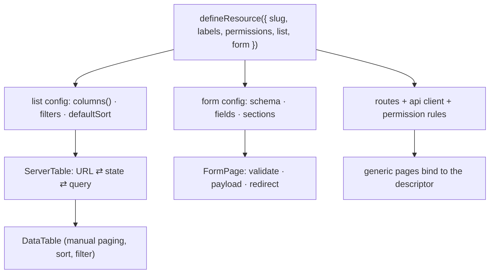

# Case 04 — Declarative admin

**One resource file generates its list, form and detail pages — and the table
behind the list keeps its entire state in the URL.**

`Svelte 5 runes` · `TypeScript` · `headless table core` · `URL-synced state` · `direction-safe CSS`

---

## The problem

An admin console is a long tail of almost-identical CRUD screens: a table with
paging, sorting, search, a filter drawer and a column toggle; a create/edit form
with validation; a details page. Written by hand, every screen re-implements the
same little state machine, and every screen finds a slightly different bug — one
forgets to reset the page when a filter changes, another loses the row selection
when the link is shared, a third lets the URL drift out of sync with the screen.
Copy-paste scales the code, not the correctness. After the fifth resource,
"add a screen" is a day of cloning and a week of remembering which clone had the
fix.

**The constraint:** a resource must be declared once, its pages must be generated
from that declaration, and the *URL* — not component state — must be the source
of truth for anything a user can share or reload.

## The approach

`defineResource` takes a declaration and returns a live object: an API client, the
route of every page, a permission rule per action, and the list and form
configuration. The pages are generic and read the descriptor; they never name a
resource.



The pages stay thin because the decisions live in the declaration: a resource
without a details page omits `routes.detail`, and the list drops the view action.

## The interesting part

### 1. Descriptor-copy reactivity: copy the getter, not its value

The table core is a headless library. It stores the options object we hand it and
reads `options.data` / `options.columns` later, outside Svelte's reactive graph.
A normal `{ ...options }` would *evaluate* those getters at build time and freeze
the table on its first snapshot. So the merge copies accessor properties as
accessors: the getter is re-installed on the target, and every later read re-runs
the rune inside whichever scope asked for it.

```ts
for (const key of Object.keys(source as object)) {
	const descriptor = Object.getOwnPropertyDescriptor(source, key);
	if (!descriptor) continue;
	Object.defineProperty(
		target,
		key,
		descriptor.get
			? { enumerable: true, configurable: true, get: descriptor.get }
			: { enumerable: true, configurable: true, writable: true, value: descriptor.value }
	);
}
```

The adapter then re-applies the options in a `$effect.pre`, so `data` and
`columns` are refreshed before the next paint and the table never renders a frame
of stale rows:

```ts
function sync() {
	table.setOptions((previous) =>
		mergeLive(previous, options, {
			state: mergeLive(state, options.state || {}),
			onStateChange: (updater) => { /* mirror into $state */ }
		})
	);
}
sync();
$effect.pre(() => sync());
```

### 2. The URL is the source of truth

`createServerTable` derives its list state from `url.searchParams`. A
component-local `$state` exists only for the embedded case (`syncUrl: false`),
where a nested table must not clobber the host page's query string. Writing state
is deliberately a navigation that *preserves* params the table does not own
(`?tab=`, a scoping id), and it skips the navigation entirely when nothing
changed:

```ts
const listState = $derived(syncUrl ? parseListState(url.searchParams, cfg) : localState);

function setListState(next: ListState) {
	if (sameListState(next, listState, cfg)) return;      // no-op: no history entry
	if (!syncUrl) { localState = next; return; }
	const qs = writeListState(next, cfg, url.searchParams).toString();
	void goto(`${url.pathname}${qs ? `?${qs}` : ''}`, { keepFocus: true, noScroll: true });
}
```

`writeListState` deletes every param the table owns and re-writes only values
that differ from the default, so `/items` stays clean and a shared link contains
exactly the state that matters.

Selection is the subtle one. It belongs to one page, one filter set, one search —
a different query returns different rows, and a checkbox index means nothing
across them. The table scopes selection to a fingerprint of the API query; when
the query changes, the selection is simply gone:

```ts
const queryId = $derived(JSON.stringify(apiQuery));
const rowSelection = $derived(selection.query === queryId ? selection.rows : {});
```

### 3. Physical CSS is a bug, so a linter refuses it

The console ships in two writing directions. A `pl-4` or a `text-right` is correct
in one and wrong in the other, and the mistake survives review because it looks
fine to a left-to-right reader. A small script walks the source, flags physical
direction utilities, and names the logical replacement:

```js
const PHYSICAL = [
	/^(?:pl|pr|ml|mr|left|right)-.+$/,
	/^(?:border|rounded)-(?:l|r|tl|tr|bl|br)(?:-.+)?$/,
	/^(?:text|float|clear)-(?:left|right)$/
];
// pl -> ps, mr -> me, text-right -> text-end, rounded-l -> rounded-s, ...
```

It runs in CI with exit code 1, offers `--fix` to rewrite what it can, and
honours a trailing `direction-lint-ignore` for the rare intentional exception.
Physical utilities do not reach the main branch, so the two directions cannot
drift apart one commit at a time.

## Tradeoffs

- **A filter change is a navigation.** URL state makes every list shareable and
  reload-safe, but routing has to stay cheap: debounced search, `keepFocus`,
  `noScroll`, and a no-op guard that avoids a history entry. Embedded tables opt
  out with `syncUrl: false`.
- **The merge helper is clever, and clever is a liability.** A careless
  `{ ...options }` elsewhere would silently freeze reactivity — no type error,
  just a table that stops updating. The cost is a focused unit test that fails
  for a naive spread, and keeping every option merge in one function.
- **The headless core is not rune-aware.** The adapter mirrors table state into
  `$state` and re-applies options in `$effect.pre` — glue code, but *one* piece
  shared by every table instead of per-screen wiring.
- **The definition is code, not JSON.** Fields, `visible` predicates, labels
  (`() => string`) and permissions are all functions, so a descriptor cannot be
  serialized or generated from a schema. For an admin console authored in
  TypeScript that is the right side of the trade: conditional fields (`city` only
  after `country`) and locale-reactive labels need functions.

## Testing

The list-state machine is pure, so it is tested without a browser. Round-trips,
omitted defaults, and preserved foreign params:

```ts
it('keeps params the table does not own', () => {
	const url = new URLSearchParams('tab=billing&page=3');
	const next = writeListState({ page: 1, limit: 25, search: '', sort: null, filters: {} }, cfg, url);
	expect(next.get('tab')).toBe('billing');
	expect(next.has('page')).toBe(false);   // default, omitted
});
```

Reactivity has its own test: a descriptor merged through `mergeLive` must still
see a later change, while a naive spread looks correct once and then never
again. The linter is tested against fixtures (a physical line, a logical line,
an ignored line) and its `--fix` output is asserted. Selection scoping is pinned
the same way: change the query, expect an empty selection.

- [`code/define-resource.ts`](code/define-resource.ts) — the one-file declaration and everything derived from it
- [`code/table-options.svelte.ts`](code/table-options.svelte.ts) — the descriptor-copy merge and the Svelte 5 table adapter
- [`code/server-table.svelte.ts`](code/server-table.svelte.ts) — URL ⇄ state ⇄ query, and query-scoped selection
- [`code/ResourceListView.svelte`](code/ResourceListView.svelte) — the generic list page built only from the descriptor
- [`code/lint-direction.mjs`](code/lint-direction.mjs) — the physical-direction lint

## What this demonstrates

- Turning a repetitive UI into a **single declaration** that generates routes,
  permissions, columns, filters and forms.
- Deep understanding of **Svelte 5 reactivity at a library boundary**:
  accessor-preserving merges, `$effect.pre`, and why eager spreading breaks a
  rune-aware component.
- **URL as state**: shareable, reload-safe lists with no-op navigation guards,
  and selection scoped to the query it belongs to.
- Making a **whole class of bug impossible** — physical CSS in a bidirectional
  UI — with a linter that fails the build.
- Separating **pure state logic** (parse / write / serialize) from the component
  so it can be unit-tested exhaustively.
