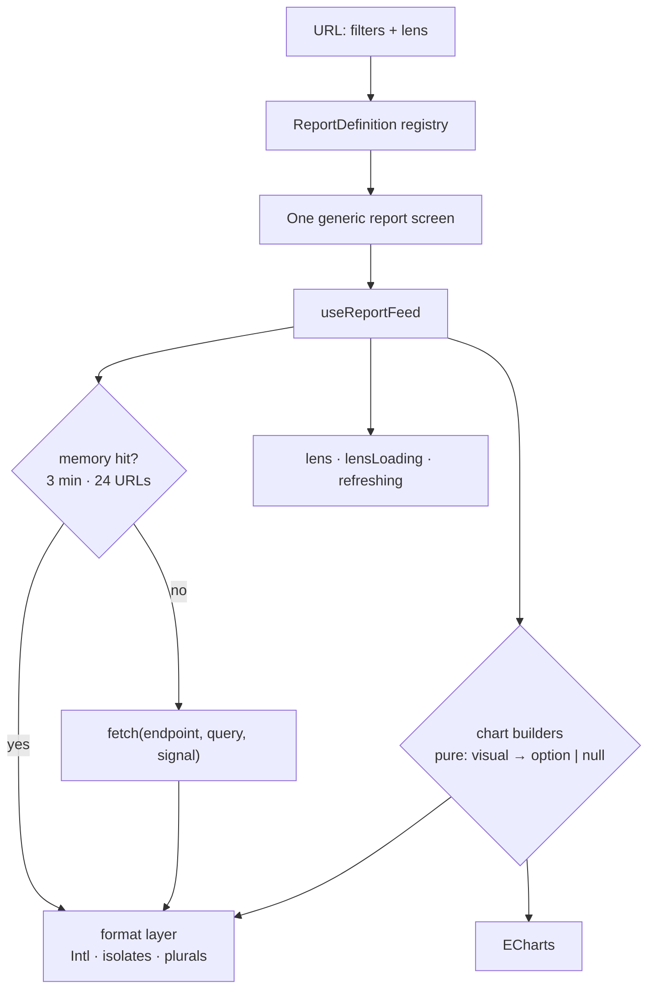

# Case 05 — Reporting engine

**A suite of report pages, one screen: a definition registry drives every lens, and
one feed turns the URL into a cached, cancellable answer that is correct
right-to-left.**

`Vue 3` · `Nuxt` · `TypeScript` · `ECharts` · `Intl` · bidi & Arabic plurals

---

## The problem

An analytics console grows pages: overview, audience, workspaces, sessions,
revenue, cohorts, campaigns, catalog, quality. Each answers several questions —
the sessions page has *path*, *dropoff* and *peak*. Built naively, every page
becomes its own component with its own fetch, loading flag and chart wiring,
and three failures follow.

**Racing requests and duplicated chart code.** Every click is a request, and
rapid filter changes let the slowest answer win instead of the latest; eight
kinds of chart across ten pages each re-derive axes, palettes and empty states.

**Arabic breaks, quietly.** A signed percentage flips its sign inside a
right-to-left line; a plural disagrees with its count; a date uses different
digits from the card beside it. It does not throw — it reads wrong to the only
people who can see it.

**The constraint:** a page should be *configuration*, a chart a *pure
function*, and every figure written by one module so reports cannot disagree.

## The approach

A single registry of `ReportDefinition`s drives the sidebar, the route guard
and one generic report screen, so adding a page is adding an entry. The URL
carries filters and lens and is the source of truth; lenses are cuts of the
same payload, never new endpoints. The feed layers caching and cancellation
over the URL; the chart builders are pure functions from a visual contract to
ECharts options or `null`; one formatting module knows about bidi and plurals.



## The interesting part

### 1. One fetch, keyed by URL, cached as an LRU, cancelled on change

The last answer of every URL is kept in a `Map` used as an LRU: a read
re-inserts the key so it moves to the end, and anything past twenty-four entries is
evicted from the front. A `recall` that ignores entries older than the server's
own three minutes stops memory outliving the truth.

```ts
const remember = (key, payload) => {
  memory.delete(key)                              // re-insert moves to the end:
  memory.set(key, { payload, at: Date.now() })    // the map order is recency
  while (memory.size > KEPT)
    memory.delete(memory.keys().next().value)
}
```

A response that returns *after* its request was abandoned answers a question
nobody is asking any more, so it is dropped rather than drawn. The debounce has
two speeds: a change of **filters** waits 300 ms (a burst of clicks becomes one
request) and aborts whatever is in flight, while a change of **lens alone**
goes at once, because the filters decide the cost. The feed tells them apart by
keying the request twice — once including the lens, once with it stripped
(`withoutLens`). That distinction buys three derived states: `lensLoading`
(same filters, new lens — only the lens's place waits), `refreshing` (new
filters — the page keeps what it shows, dimmed) and `lens` (`null` until the
answer for *this* URL is on screen).

### 2. Bidi isolates: a sign and its number never separate

A signed number is a run of left-to-right characters. Dropped into a
right-to-left sentence unisolated, the sign migrates to the wrong end and
`-12.9%` reads as if the percent were subtracted. The fix is invisible — an
LRI/PDI pair around the value — so it costs a copy-paste nothing.

```ts
const LRI = '\u2066'   // left-to-right isolate
const PDI = '\u2069'   // pop directional isolate

export const isolate = (text: string): string => `${LRI}${text}${PDI}`
```

Every axis tick goes through `isolate`, so the sign of a negative rate stays in
front. Digits are whatever `Intl` resolves for the browser's locale, not a
hand-picked set, so a chart axis, a KPI and a table cell all use the same
numerals; money keeps the console's shared price formatter, and a canvas label
strips its markup.

### 3. Arabic plurals: the count chooses the form and the noun agrees

One function decides how a count and its unit are written — for points, for
durations, and for a past time (`ago`). The plural category comes from
`Intl.PluralRules`; days, hours and minutes borrow `Intl.NumberFormat` with
`style: 'unit'`; points have no `Intl` unit, so the locale file carries one form
per category.

```ts
export function formatUnit(value: number, unit: UnitFormat, t: Translate, when?: 'ago'): string {
  const locale = unitLocale(t)

  if (unit === 'points') {
    const count = new Intl.NumberFormat(locale, { maximumFractionDigits: 2 }).format(value)
    const category = new Intl.PluralRules(locale, { maximumFractionDigits: 2 }).select(value)
    return t(`reports.units.points.${category}`, { count })
  }

  if (when === 'ago')
    return normalizePresentation(new Intl.RelativeTimeFormat(locale, { numeric: 'always' }).format(-value, UNIT_NOUNS[unit]))

  // Exactly one: `Intl` writes the bare noun («يوم»); «يوم واحد» reads whole in a sentence.
  if (new Intl.PluralRules(locale, { maximumFractionDigits: 1 }).select(value) === 'one')
    return t(`reports.units.one.${unit}`)

  return normalizePresentation(new Intl.NumberFormat(locale, {
    style: 'unit', unit: UNIT_NOUNS[unit], unitDisplay: 'long', maximumFractionDigits: 1,
  }).format(value))
}
```

The precision passed to `PluralRules` matches the precision that will be
*displayed* (`maximumFractionDigits: 1`), because the category of `19.1` is not
the category of `19`. And `normalizePresentation` rewrites the tanween `Intl` places
before the alef to the console's spelling after it — but only in strings that
came out of `Intl`, never in server text, so the two agree without overwriting.

## Tradeoffs

- **Memory cache, not the HTTP cache.** A `Map` gives exact control of eviction
  and freshness and works for `POST`-style report queries; the browser cache
  does not. The cost is per-tab memory that dies with the tab.
- **Two loading states.** "Another cut of the same page" is not "the page is
  being replaced"; one spinner that blanks the KPIs on every lens switch reads
  as a bug.
- **Rewriting `Intl` output is a tax.** `normalizePresentation` is a compatibility shim,
  deleted the day the house style follows CLDR; one regex at the edge beats one
  spelling per screen.
- **The lens is excluded from the filter key.** That is exactly why an lens
  switch is cheap, and it couples the feed to the query shape — documented at
  the one line that relies on it.

## Testing

The tests are aimed at the request lifecycle, not the implementation:

```ts
it('cancels the request in flight when filters change, and waits out the debounce', async () => {
  const query = ref({ period: '30d', lens: 'path' })
  const feed = useReportFeed({ endpoint, query, fetcher })

  query.value = { period: '7d', lens: 'path' }
  await nextTick()
  expect(calls[0].signal.aborted).toBe(true)   // the stale request is abandoned

  vi.advanceTimersByTime(300)
  expect(fetcher).toHaveBeenCalledTimes(2)     // one new request, not one per click

  await answer(calls[0])                        // the abandoned answer arrives late...
  expect(feed.payload.value).toBeNull()         // ...and changes nothing
})
```

Two more tests cover the rest: queries differing only in key order share one
memory entry, an lens switch raises only `lensLoading`, and a metric swap
issues no request at all.

- [`code/reportDefinitions.ts`](code/reportDefinitions.ts) — the registry: pages, lenses, permissions
- [`code/useReportFeed.ts`](code/useReportFeed.ts) — debounce, abort, LRU memory, derived loading states
- [`code/reportFormat.ts`](code/reportFormat.ts) — Intl, bidi isolates, Arabic pluralisation
- [`code/chartOptions.ts`](code/chartOptions.ts) — shared chart chrome and the pure coverage builder
- [`code/useReportFeed.test.ts`](code/useReportFeed.test.ts) — the request-lifecycle suite

## What this demonstrates

- **Data-driven UI.** One registry and one generic screen instead of ten
  hand-written pages; a new page is a row, not a component.
- **Async lifecycle discipline.** A two-speed debounce, cancellation of the
  request in flight, and a late response dropped instead of drawn.
- **A bounded cache.** An explicit LRU with a freshness window, so memory
  cannot grow without limit and a stale answer cannot outlive the server's.
- **Internationalisation as data.** Bidi isolates, locale-resolved digits,
  plural categories and unit agreement handled where the value is written.
- **Pure functions and behavioural tests.** Chart builders that map a contract
  to options or `null`, and a suite that names aborts, debounce windows and
  cache hits so a broken path fails a test that says what broke.
