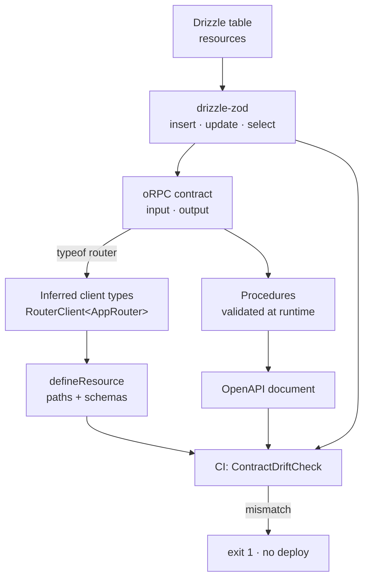

# Case 06 — Type-safe APIs

**One schema defines the database, the request, the response, and the client —
and a CI gate fails the build the moment the browser and the backend disagree.**

`Bun` · `TypeScript` · `oRPC` · `Drizzle` · `Zod` · contract-drift CI

---

## The problem

A product API and the app that calls it drift apart one field at a time. The
backend tightens a title to `min(3)` and the form still accepts one character:
the user finds out after pressing save, as a `422`. A numeric column arrives as
a decimal *string* and the admin table keeps sending numbers. A required field
appears and one screen has no control for it at all.

Sharing types looks like it solves this — export an interface, import it on both
sides — until the boundary is HTTP and JSON. At runtime a TypeScript type is
erased: the compiler never sees the backend, so it cannot tell you the deployed
API will reject the body your form just built. The types stop at the edge.

**The constraint:** there must be exactly one description of each field, and CI
must prove the front end and the back end still agree *before* either ships.

## The approach

A shared schema package is the root of truth. A Drizzle table produces the Zod
create/update/select schemas; the oRPC contract consumes those schemas as its
`input` and `output`; the browser infers its request and response types from the
router's type rather than a hand-written interface. A CI job then compiles the
front-end declarations, converts each Zod schema to JSON Schema, loads the
backend's OpenAPI document, and diffs the two field by field.



The schema crossing every layer is literal, not aspirational: the same
`resourceInsert` object is what the oRPC procedure validates, what the
repository writes, and the symbol the drift checker imports from the front end.

## The interesting part

### 1. The drift checker is a compiler, not a regex

A regex over source breaks the first time a declaration nests an object or gains
a `satisfies`. The checker parses each front-end resource file with the same
TypeScript parser the build uses, walks to the `defineResource({...})` call, and
reads `paths.base` and the schema symbol names off the AST.

```ts
const source = ts.createSourceFile(file, text, ts.ScriptTarget.Latest,
  /* setParentNodes */ true, ts.ScriptKind.TS)

function visit(node: ts.Node): void {
  if (ts.isVariableDeclaration(node) && node.initializer
      && ts.isCallExpression(node.initializer)
      && node.initializer.expression.getText() === "defineResource") {
    const config = objectOf(node.initializer.arguments[0])
    const paths = config && objectOf(property(config, "paths"))
    // ...
  }
  ts.forEachChild(node, visit)
}
```

`setParentNodes: true` matters: without parent pointers, `getText()` on a nested
node cannot resolve its source range. `replaceAll('"', "")` normalizes `"base"`
to `base`, because the parser preserves the quotes.

### 2. JSON Schema is the common tongue — read all of its branches

Zod and OpenAPI do not share a type system, but both serialize to JSON Schema.
The front-end Zod schema goes through `z.toJSONSchema`; the backend OpenAPI
already is JSON Schema. That makes the comparison mechanical — and `io: "input"`
is the detail that keeps it honest.

```ts
const frontend = z.toJSONSchema(module[symbol], {
  unrepresentable: "any",
  io: "input", // ACCEPTS, not EMITS: a .default() must not make a field required
});
```

Reading only the top-level object is wrong. An optional or nullable field
becomes an `anyOf` branch and an enum a `oneOf`, so a constraint in a branch is
invisible to a naive read. `schemaNodes` flattens `anyOf`/`oneOf`/`allOf`, and
every check reduces across the branches:

```ts
const values = schemaNodes(schema).map((node) => node[key]).filter(isNumber)
return values.length ? (mode === "min" ? Math.max(...values) : Math.min(...values)) : undefined
```

For a lower bound the strongest is the *largest* `minLength` across branches; for
an upper bound it is the *smallest* `maxLength`. A field the API requires but the
form calls optional is a `required` finding; the reverse is `strict`; an enum
that lost a member is `enum`. And `numeric` columns map to `z.string()` in
drizzle-zod, so a form that sends a number is the `wire` finding — the one users
actually feel, because it is refused only at submit.

### 3. The envelope is normalised once, at the seam

The backend wraps every body in `{ success, data, meta }`. Lists are
`data: [...]` on the generic route and `data: { rows, meta }` on paged actions,
while the UI contracts use `{ rows, items, total }`. Rather than teach every
screen the wire shape, one function translates at the boundary and passes a
plain object through untouched.

```ts
const paged = pagedActionRows(value)
if (paged !== null) return paged               // data: { rows, meta }
if (!isEnvelope(value)) return value           // not ours: pass through
return { rows: value.data, items: value.data,
  total: value.meta?.pagination?.total ?? value.data.length }
```

Keeping `success` as the discriminator matters: a `200` that is not an envelope
is passed through rather than silently rewritten to `{ rows: undefined }`.

### 4. ETag revalidation survives a private cache

Authenticated reads carry `Cache-Control: private, no-store`, so the browser's
HTTP cache can never hold them and can never revalidate. An in-memory map
recreates that revalidation one level up: keep the body an ETag names, offer the
ETag back as `If-None-Match`, and on a `304` reuse the body instead of
downloading it again. The key carries a cheap hash of the credential, because
one process answers every caller and two of them must never share an entry.

```ts
if (method === "GET" && cached) headers["If-None-Match"] = cached.etag
const text = response.status === 304 && cached
  ? cached.body : await response.text()     // 304: reuse the ETag's bytes
```

The cache is memory-only and capped, so a reload starts clean.

## Tradeoffs

- **A shared schema couples the releases.** Changing a column can now fail the
  other app's build. That is the point, but it makes a migration a deliberate
  two-app decision rather than a backend-only one.
- **The gate is a whole build step.** It imports every front-end module and
  parses every OpenAPI path, costing seconds in CI — cheap next to a `422`
  nobody can reproduce.
- **`io: "input"` is deliberate and slightly lossy.** It compares the set of
  *accepted* shapes, not the emitted ones; two schemas can agree on input and
  still emit different defaults, which the client decoder catches at runtime.
- **The ETag cache is per-process and best-effort.** It turns repeat reads into
  `304`s and makes no cross-instance promise; losing it on restart is harmless.
- **Not every column belongs on the wire.** `resourceSelect` exposes the whole
  row, so the API surface tracks the table closely — one definition, less
  deliberate curation.

## Testing

The drift gate tests the seam; the compiler tests the contract. Both name the
field and the mismatch, so the fix is mechanical.

```ts
it('pins the bound the form must not loosen', () => {
  const schema = z.toJSONSchema(resourceInsert, { io: 'input' }) as any
  expect(bound(schema.properties.title, 'minLength', 'min')).toBe(3)
})

it('flags a decimal sent as a number', () => {
  expect(driftKindFor({ type: 'string' }, { type: 'number' })).toBe('wire')
})
```

A second layer covers the transport: a mismatched envelope surfaces as
`ApiError(422, "schema_mismatch")`, a `304` reuses the cached body, and a `200`
with no envelope is passed through rather than rewritten.

- [`code/resource.schema.ts`](code/resource.schema.ts) — the one schema: table, row types, Zod create/update/select
- [`code/resource.contract.ts`](code/resource.contract.ts) — oRPC procedures, envelopes, router types
- [`code/resource.repository.ts`](code/resource.repository.ts) — Drizzle queries typed by the schema's own inference
- [`code/resource-client.ts`](code/resource-client.ts) — envelope normalisation, ETag cache, `defineResource`
- [`code/check-contract-drift.ts`](code/check-contract-drift.ts) — the CI gate: compiler API + JSON Schema diff

## What this demonstrates

- **One definition end-to-end.** The database, the runtime validation, the
  response schema, and the client types are derived, so they cannot disagree.
- **The TypeScript compiler API used as a tool**, not a curiosity: parse, walk,
  and read declarations with the same tree the build trusts.
- **Schema conversion with judgment.** `io: "input"`, branch flattening, and
  strongest-across-branches bounds — the details that decide whether a diff is
  meaningful or noisy.
- **A contract gate that fails loudly** at the exact field that drifted, plus a
  transport with one normalisation seam and one error shape.
