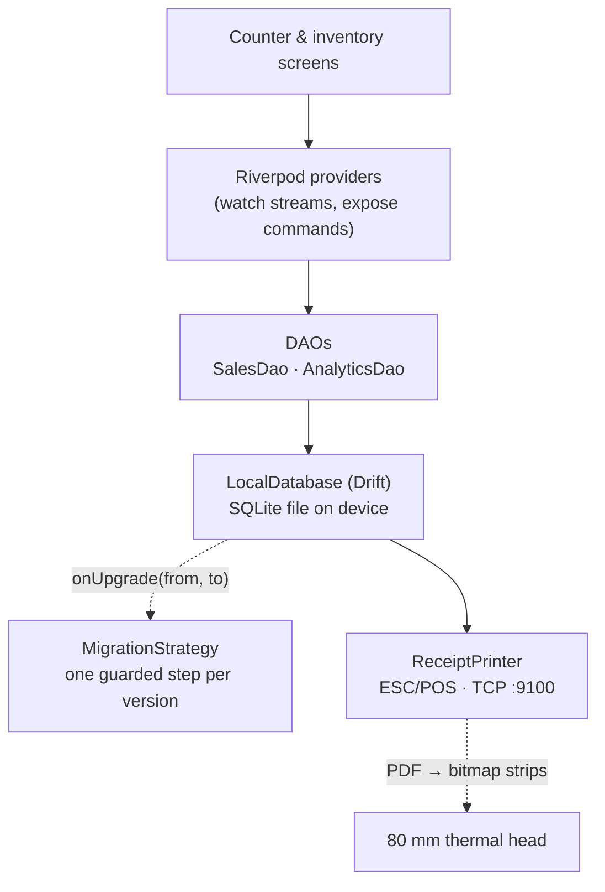

# Case 07 — Offline-first mobile

**A shop-counter app where the phone is the system of record: the schema
evolves in numbered steps on devices you cannot reach, reports run as SQL over
the local file, and receipts go straight to a thermal head.**

`Dart 3` · `Flutter` · `Riverpod` · `Drift (SQLite)` · `ESC/POS`

---

## The problem

A till in a shop with bad connectivity cannot depend on a server. The local
SQLite file is the live data, not a cache: operators take sales, adjust stock,
and print with the network down, and the numbers must be right when it returns.

First, **migrations are the product.** A new schema version runs on devices you
will never see, several versions behind, any of which may lose power mid-upgrade.
A migration that only works on a clean, current database is not a migration.

Second, **the workload lives on the device.** "Load everything and aggregate in
memory" is fatal on a mid-range phone with three years of sales, and the receipt
is a right-to-left document that cheap thermal heads cannot shape. **The
constraint:** correctness and speed must both survive on hardware the developer
does not control.

## The approach

UI talks to `Riverpod` providers; providers watch `Drift` streams exposed by
`DAO`s; the DAOs own transactions and stock side effects; the `LocalDatabase`
owns the versioned `MigrationStrategy`; reports go through one analytic DAO; the
printer bypasses text rendering and sends bits.



The rule that ties it together: **no one else writes the stock side effect of a
sale.** `SalesDao` inserts the line and moves the stock in the same transaction,
so a line and the quantity it consumed can never be written by two paths that
drift apart.

## The interesting part

### 1. Migrations that survive being interrupted

Every step is guarded by the version the device is upgrading *from*, never by
the current one, so a device that skipped three releases replays each step in
order. Then each step is made idempotent, because the failure being guarded
against is a crash between "apply the change" and "record the new version":

```dart
if (from < 6) {
  await m.createTable(groups);
  await _addColumnSafe(m, items, items.tagId);
  await _backfillGroupsFromLegacyItems();
  // An index that still names category_id blocks DROP COLUMN, so it has to go
  // first — otherwise SQLite raises a misleading "missing column" fault.
  await customStatement('DROP INDEX IF EXISTS idx_items_category');
  await _dropColumnSafe('items', 'category_id');
}
```

`_addColumnSafe` and `_dropColumnSafe` swallow exactly the error a re-run
produces, and nothing else — `duplicate column` and `no such column`
respectively; anything else is rethrown so a real fault is never hidden.

When a change cannot be expressed as `ALTER TABLE` — relaxing a `NOT NULL`, or
changing a stored shape — the table is rebuilt: foreign keys off, a `_new` table
created, rows copied over, the old table dropped, the new one renamed, keys back
on. Data conversions follow the same rule: copy, then drop, so a crash in
between leaves a column that is ignored on the next run rather than data already
thrown away. The seconds-to-milliseconds pass is bounded to the only date range
seconds could represent, so it cannot touch values from a newer schema.

### 2. Analytics in SQL, not in the Dart heap

Reports never load the ledger. Each query reduces the lines in one CTE, joins
that to the header, and projects what it needs. The grand total is defined
exactly once and reused, because a second copy of that formula is a
reconciliation bug waiting for a discount change:

```dart
static String _grandTotalSql(final String sale, final String reduced) {
  return '''
(CASE WHEN COALESCE($reduced.sub, 0) - COALESCE($reduced.ld, 0) - $sale.discount_value < 0 THEN 0
 ELSE COALESCE($reduced.sub, 0) - COALESCE($reduced.ld, 0) - $sale.discount_value END)
+ ROUND((CASE WHEN ... END) * $sale.tax_percent / 100.0, 2)
''';
}
```

The `CASE ... THEN 0` clamp is not decoration: a header discount larger than the
lines must not produce a negative net that then has tax charged against it. The
unpaid-balance report folds lines and payments first, then sorts every open sale
into an age bucket in the same statement:

```sql
CASE
  WHEN (? - created_at) <= 30 * 86400000 THEN 'b0'
  WHEN (? - created_at) <= 60 * 86400000 THEN 'b1'
  WHEN (? - created_at) <= 90 * 86400000 THEN 'b2'
  ELSE 'b3'
END AS bucket
```

Time buckets are the one place SQLite needs a nudge: it has no date-truncation
function that takes a millisecond epoch, so the column is divided to seconds and
handed to `strftime` with the format matching the requested bucket.

### 3. Printing a script the printer cannot shape

The receipt is Arabic and right-to-left. Cheap 80 mm heads have no font for it
and no bidi logic, so the text is rendered to PDF with the app's own font,
rasterised, and streamed as a bitmap. Two hardware details dominate.

The first is transparency. The platform rasteriser emits an untouched page as
fully transparent RGBA `(0,0,0,0)`. The encoder turns a bitmap into dots with
`grayscale → invert → threshold`, which reads transparent black as ink — so the
whole receipt would print as a solid black rectangle. It is flattened first:

```dart
img.fill(canvas, color: img.ColorRgba8(255, 255, 255, 255));
img.compositeImage(canvas, source);
```

The second is the command. Many low-cost heads do not implement the newer
`GS ( L` graphics command and fall back to text mode, printing command bytes as
ASCII gibberish — the "random letters at the top of the receipt". The legacy
`GS v 0` raster command is universal; and because the row count shares a
two-byte field while the real buffer is far smaller, the image goes out in
~256-row strips so the head flushes each one:

```dart
final bytes = <int>[...generator.reset(), 0x1B, 0x33, 24]; // ESC @ reset, ESC 3 24 → 24-dot feed
```

### 4. Arabic search is an algorithm, not a `LIKE`

Hand-typed names carry diacritics, a tatweel that stretches a word, several
spellings of alef and hamza, ta-marbuta for heh, and the definite article "ال"
glued to the front. `normalizeArabicSearch` folds all of it — marks and tatweel
removed, variants unified, whitespace collapsed, one leading "\u0627\u0644"
stripped — so the match becomes a substring test and "الجرس" collapses onto
"جرس".

## Tradeoffs

- **The analytics are raw SQL, not Drift's typed DSL.** I gave up compile-time
  column checking for a CTE chain in one statement. The mitigation: every table
  is in the DAO's `@DriftAccessor` and the totals formula lives in one place, so
  a rename breaks loudly and is fixed once.
- **Rebuilding a table is a full copy.** Used only where `ALTER TABLE` genuinely
  cannot do the job; additive migrations are preferred as O(1) metadata changes.
- **Raster receipts are heavier than text.** A bitmap is kilobytes and slightly
  slower to emit, but text was not an option for this script on this hardware.
- **Milliseconds, not ISO strings, for time**, and **no raw USB printing**: the
  former indexes cheaply but reads badly (debug tooling formats on the way out);
  the latter needs a platform USB host API and per-chipset quirks, and pretending
  the same path covers it would be a latent field failure.

## Testing

The migration is tested the only way that matters: build a database at an old
schema version, populate it in the old shape, run the real upgrade, and assert
both the shape and the converted data.

```dart
test('v5 → v24 backfills a general subgroup per legacy category', () async {
  final db = LocalDatabase.connect(NativeDatabase.memory());
  await db.customStatement('PRAGMA user_version = 5');
  // insert a legacy item with a flat category_id ...

  await db.migration.onUpgrade(db.createMigrator(), 5, db.schemaVersion);
  expect(await db.select(db.subgroups).get(), hasLength(1));
});
```

The rest of the suite pins failure modes, not structure: an insufficient-stock
sale rolls back header and lines; an overpayment is refused and the paid total
untouched; removing a line that already has a return is refused while a clean
line restores stock; the raster chunker emits the right strip count and the
flattener turns a transparent pixel white; and `normalizeArabicSearch` maps
"الجرس", "جرسٌ", and "جرس" to the same key.

- [`code/local_database.dart`](code/local_database.dart) — the schema, the guarded migration path, and the safe helpers
- [`code/sales_dao.dart`](code/sales_dao.dart) — transactional sale, payment, return, and stock handling
- [`code/analytics_dao.dart`](code/analytics_dao.dart) — the CTE-based reports and aging buckets
- [`code/receipt_printer.dart`](code/receipt_printer.dart) — PDF to ESC/POS raster over TCP
- [`code/search_normalizer.dart`](code/search_normalizer.dart) — Arabic-aware catalog search

## What this demonstrates

- Treating **local migrations as a first-class, testable product** — guarded by
  the source version, idempotent, copy-before-drop, safe when interrupted.
- Knowing when to leave the ORM: **analytic SQL with CTEs** instead of loading a
  ledger into memory, and where SQLite needs help.
- **Hardware empathy** — transparency, command fallbacks, buffer limits, and
  line spacing, explained at the level that predicts whether a receipt prints.
- **Transaction boundaries that own side effects**, language-aware search, and
  **tests around the failure modes** rather than the happy path.
