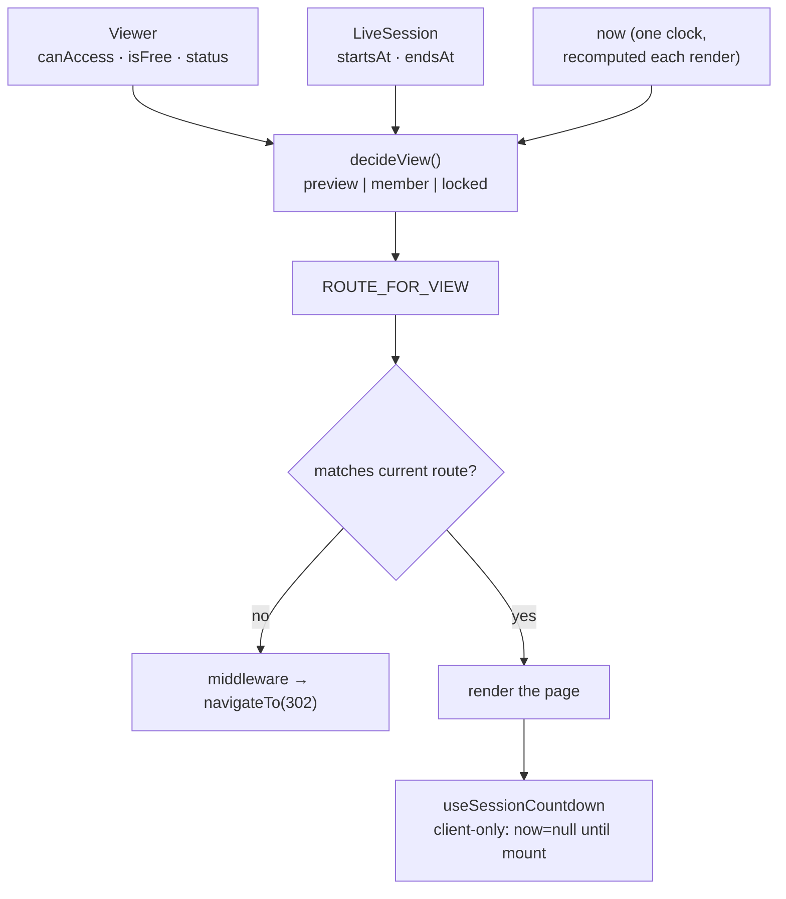

# Case 08 — Transient entitlement routing

**Two axes — who holds access, and where the session sits in time — decide what a
live-session page may show, and one pure function decides it for the server and
the client alike.**

`TypeScript 5` · `Vue 3` · `Nuxt` · route middleware · `Vitest` · SSR/client clock agreement

---

## The problem

A learning platform runs live sessions, and one URL serves four audiences:

- a **member** who holds the session: the full player, live or on replay;
- a **guest before** a paid session: a marketing page — outline, speaker, a
  countdown, a subscribe call to action;
- a **guest during or after** a paid session: the locked member page with an
  upgrade CTA, never the stream;
- **anyone** on a free session: the session itself.

Two independent questions decide it: **entitlement** (does this viewer hold a
grant, or is the session free?) and **time** (upcoming, live, or past).

Built naively, those checks spread across components and drift. A tab left open
across the start keeps showing "upcoming" because the status was read once at
render; a "past" session is treated as a public archive and leaks a paid
recording. Nothing throws — the wrong page renders for the wrong person.

**The constraint:** one pure function decides, routing enforces it once, and the
clock is resolved so the server and the client agree.

## The approach

`decideView(viewer, session, now)` maps the two axes onto three views — built
on `canPreview` — `preview`, `member`, `locked`, and a route table maps a view
to a page. The route guard fetches the session once and asks `resolveRedirect`
whether the current route matches; the page and the countdown call the same
functions, so there is one decision with two readers.

The countdown is the one place the *client* owns time: it renders nothing until
mount, then resolves the browser's timezone and ticks, so the server HTML and
the first client render are identical.



## The interesting part

### 1. Guest is a marketing route; locked is a paywall

One "can they watch?" flag loses a distinction. "Cannot watch" is two states: a
guest *before* a paid session should see the marketing page (that is how it
sells), while a guest *during or after* one should see the locked member page.
The clock only ever widens the marketing route:

```ts
export function decideView(viewer, session, now) {
  if (viewer.canAccess)
    return 'member'

  if (viewer.isFree || sessionStatusAt(session, viewer.status, now) === 'upcoming')
    return 'preview'

  return 'locked'
}
```

The `upcoming` branch is the only place time touches the preview. A free session
previews regardless of the clock; a paid session that is `live` or `past`
without a grant falls through to `locked`. The edge a naive "past content is
public" rule gets wrong is pinned in the tests: a paid session that has **ended**
with no access stays locked, because that recording is the member's replay.

### 2. The clock is recomputed, not trusted

The backend answers with a last-known status because it must answer something;
that status is true for an instant and false five minutes later. `decideView`
takes `now` and derives the status from the session's own bounds, using the
server's field only when no start was sent:

```ts
export function sessionStatusAt(session, fallback, now) {
  const start = toInstant(session.startsAt)
  if (start === null) return fallback
  if (now < start.getTime()) return 'upcoming'

  const end = toInstant(session.endsAt)
  if (end !== null) return now < end.getTime() ? 'live' : 'past'

  return now - start.getTime() < DEFAULT_LIVE_WINDOW_MS ? 'live' : 'past'
}
```

The guard and the page pass the same instant to the same function, so a session
that starts while a tab is open flips from the marketing view to the player on
the next render — no poll, no second definition of "live". The fallback keeps a
server that omits timing usable instead of pushing everyone into `past`.

### 3. The countdown renders nothing until it is allowed to

A countdown hydrates wrong because server and client compute a number from
different clocks. This one makes the first paint identical by making it *empty*:
`now` starts `null` on both sides, so the parts are `null` until mount. Only
then does the client resolve the browser timezone and start ticking.

```ts
const now = ref<number | null>(null)
const parts = computed(() =>
  now.value === null ? null : countdownParts(target.value, now.value),
)

onMounted(() => {
  const zone = browserTimezone()
  if (zone) { timezone.value = zone; tzCookie.value = zone }

  tick()
  timer = setInterval(tick, options.intervalMs ?? 1000)
})
```

The timezone is persisted to a `viewer-tz` cookie for the next server render but
only *written* after mount, so a value that arrives late can never tear streamed
markup. The timer is cleared on unmount.

## Tradeoffs

- **A view, then a route table.** Adding a view is a row; the decision and the
  guard never learn about each other.
- **`now` is a parameter.** The only impure call site is the guard; tests pin an
  instant and assert the whole matrix.
- **A default live window (three hours) when no end is sent.** A named guess beats a session that is "live" forever.
- **Client-only countdown costs a placeholder flash.** Rendering a server number
  would either mismatch at hydration or tick from the wrong epoch.
- **The guard fetches the session for the marketing route too.** One request on
  the server, reused by the page by key; the alternative is a per-component
  fetch and a waterfall.
- **The player's provider stays out of the policy.** It is presentation; branching on it would be a hidden second copy of this decision.

## Testing

The tests are a table, because the policy *is* a table:

```ts
const NOW = Date.parse('2026-03-01T12:00:00Z')
const at = (minutes: number) => new Date(NOW + minutes * 60_000).toISOString()

it.each([
  ['a grant is a member, whatever the clock says',
    { canAccess: true }, { startsAt: at(-180), endsAt: at(-120) }, 'member'],
  ['an upcoming paid session is previewable to sell it',
    {}, { startsAt: at(30), endsAt: at(90) }, 'preview'],
  ['a live paid session without a grant is locked',
    {}, { startsAt: at(-30), endsAt: at(30) }, 'locked'],
  ['a past paid session without a grant stays locked',
    {}, { startsAt: at(-180), endsAt: at(-120) }, 'locked'],
])('%s', (_label, viewerFlags, sessionBounds, expected) => {
  expect(decideView(viewer(viewerFlags), session(sessionBounds), NOW)).toBe(expected)
})

it('does not trust a snapshot the clock has outlived', () => {
  const started = session({ startsAt: at(-5), endsAt: at(55) })
  expect(sessionStatusAt(started, 'upcoming', NOW)).toBe('live')
})
```

The redirect cases are asserted alongside: the member route is sent to the
preview when only a preview is allowed, the preview route is sent back to the
locked member route for a live or past paid session, an already-correct route
yields no redirect, and a session that has not loaded does nothing so the page
can own its 404.

- [`code/accessPolicy.ts`](code/accessPolicy.ts) — the pure viewer × session × now decision
- [`code/accessPolicy.test.ts`](code/accessPolicy.test.ts) — the full decision matrix and clock cases
- [`code/useSessionCountdown.ts`](code/useSessionCountdown.ts) — client-only now, timezone resolution, countdown parts
- [`code/session-access.ts`](code/session-access.ts) — the route guard that applies the policy

## What this demonstrates

- **One decision, one enforcement point.** A pure function computes the view,
  middleware routes on it, and components read the same answer instead of
  repeating the rules.
- **Two orthogonal axes, combined explicitly.** The guest-versus-locked boundary
  is a line of code, not an emergent behaviour of flags.
- **A status snapshot treated as stale by design.** Recomputing from the
  session's bounds and one `now` keeps the guard and the page in agreement.
- **Hydration solved at the source.** The client-only value starts empty, so the
  first render matches without a suppression flag.
- **Tests aimed at the edge.** The matrix names the past-paid-locked and
  stale-snapshot cases, so a regression fails the test that describes it.
