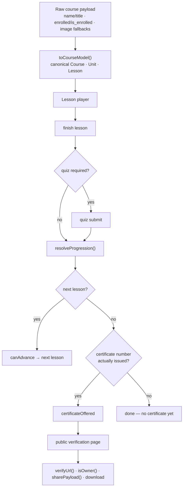

# Case 09 — Course progression & certificates

**A course API that grew three names for every field is normalised once into a
canonical outline; a lesson advances only past a quiz that passed; and the
certificate is offered only when the backend actually issued one — never merely
because the next-lesson pointer ran out.**

`TypeScript` · `Vue 3` · `Nuxt` · REST course API · public certificate verification

---

## The problem

The course payload is a decade of small additions stacked on top of each other.
A unit's title is `name` on newer endpoints and `title` on older ones; the
enrollment flag is `enrolled` or `is_enrolled`; an image is a `banner_image_url`,
an `image_url`, or both with one empty; requirements appear under
`previous_requirements` and, on some responses, the misspelled
`previouse_requirements`. None of it is wrong — it is what an API looks like
after years of serving screens that each needed one more field. Left alone,
every component learns the same fallbacks slightly differently, and the outline
drifts between the course page, the player, and the quiz.

The second problem is gating. Finishing a lesson returns a bundle: did it
finish, was there a quiz, did it pass, what is next. The naive rule — *no next
lesson means the course is finished* — is wrong twice over. A partial outline
reports "no next lesson" while a later unit is unfinished, and a finished course
may not have had its certificate issued yet. Offering "Get certificate" on
either is a dead end.

**The constraint:** disagreement about what an outline contains or when a course
is over must be impossible, not merely unlikely.

## The approach

Three seams, each owning one decision. `toCourseModel` turns the raw payload
into `Course` / `Unit` / `Lesson` once. `resolveProgression` turns the finish
signal into `{ canAdvance, certificateOffered, nextLesson }`. The certificate
page turns an issued certificate into a public verification URL, a share
payload, and a download state.



The rule that ties model to gate: **the certificate is a fact the backend
reports, not an inference the client makes.** Nothing reconstructs "finished"
from the shape of the outline.

## The interesting part

### 1. Normalise once, at the seam

The synonyms collapse in one function, so no screen ever sees an `undefined`
title or a double image field. The fallback order is documented once, and a
blank string loses rather than winning and rendering nothing:

```ts
const firstNonEmpty = (...values: (string | null | undefined)[]): string | null =>
  values.find((v): v is string => typeof v === "string" && v.trim() !== "") ?? null;

return {
  banner: firstNonEmpty(raw.banner_image_url, raw.image_url) ?? "",
  enrolled: raw.enrolled ?? raw.is_enrolled ?? false,
  currentLessonSlug: firstNonEmpty(raw.current_lesson_slug, firstSlug),
  units,
};
```

Chapter labels come from **position**, not the payload, so a reordered outline
relabels itself.

### 2. The certificate-offer correctness rule

This is the bug the case exists for. `resolveProgression` refuses to read the
absence of a next lesson as completion; only a non-blank issued certificate
number opens the CTA:

```ts
if (nextExists) {
  return { canAdvance: true, certificateOffered: false, nextLesson: next };
}

const issued = (result.certificateNumber ?? "").trim() !== "";
return issued
  ? { canAdvance: false, certificateOffered: true, nextLesson: null }
  : { canAdvance: false, certificateOffered: false, nextLesson: null };
```

A required-and-failed quiz blocks advancement even when a next lesson is known,
so the gate cannot be skipped. When the last lesson is passed but the submit
response carried no number, the client re-reads the lesson detail once — the
certificate may have been issued between calls — and still shows nothing until
the number is present.

### 3. A certificate is a public, verifiable artifact

Anyone with the number may open the page, so it is an artifact, not a private
screen. The URL is a pure function of the origin and number:

```ts
export function verifyUrl(origin: string, certificateNumber: string,
  basePath = "/courses/certificate"): string {
  return `${origin.replace(/\/+$/, "")}${basePath}/${encodeURIComponent(certificateNumber)}`;
}
```

Ownership decides **copy, not access** — access is open by design. It only picks
first- versus third-person share text and the "we emailed this to you" note. It
folds case and whitespace, so `Ada  Lovelace` matches `ada lovelace`, and never
returns `true` for an empty name:

```ts
const foldName = (value?: string | null) =>
  (value ?? "").trim().replace(/\s+/g, " ").toLowerCase();

export const isOwner = (cert: Certificate, viewer: Viewer | null): boolean =>
  foldName(cert.holderName) !== "" && foldName(cert.holderName) === foldName(viewer?.name);
```

Download is a four-state machine — `idle` / `preparing` / `ready` / `failed` —
slow enough that the button must disable while it runs and recover from a
failure. `beginDownload` is idempotent, so a second click cannot queue a second
render.

## Tradeoffs

- **Ordinals are numerals, not spelled words.** `ordinalLabel` returns `"1st"`,
  `"42nd"`, and the bare numeral for locales it cannot spell. A word list only
  covered one to ten and broke on the eleventh unit.
- **`isOwner` compares names, and that is knowingly weak.** It is a
  presentation hint, not authorization — the certificate is public by number.
  The session establishes identity; the match only picks share wording.
- **The canonical model is closed.** `toCourseModel` copies known fields and
  drops the rest, so a new API field needs a deliberate edit. That friction is
  the feature: the model is the contract, not a passthrough.
- **Chapter labels trust array order.** An explicit ordering key that differed
  from array order would label the wrong way — acceptable while the outline is
  authoritatively ordered.
- **The download state dies on reload.** A `blob:` URL is process-scoped, so
  the page starts at `idle`; caching it would be a second source of truth.

## Testing

The tests name behaviour, not implementation. The one that matters most pins
the offer rule against a plausible-looking lie: a completed, passed lesson with
an empty next-lesson pointer and no certificate yet.

```ts
it("does not offer a certificate just because the next-lesson pointer ran out", () => {
  const result = resolveProgression(completion({ quizRequired: true, quizPassed: true }));

  expect(result.canAdvance).toBe(false);
  expect(result.certificateOffered).toBe(false);
  expect(result.reason).toBe("done_without_certificate");
});
```

The rest covers the data and the state: a unit titled only `title` still gets a
name; an unknown lesson type defaults to `video`; a blank image falls through to
the banner; a failed quiz blocks advancement; `isOwner` folds case and refuses
an empty name; `verifyUrl` encodes the slashes in a certificate number; and
`beginDownload` is idempotent while a render is in flight.

## What this demonstrates

- **Normalise dirt once.** One adapter at the boundary beats the same fallbacks
  copied into every component, and makes "what does a field mean" reviewable.
- **Deriving a correctness rule from an ambiguous signal.** "No next lesson"
  looks like completion and is not; the certificate is the fact the gate reads.
- **Public artifacts as a design constraint.** Verification URLs, ownership as
  copy rather than access, and share text correct for owner and visitor alike.
- **Edge cases where they occur:** the retake that must not advance, the partial
  outline, the certificate not yet issued, the empty image, and someone else's
  certificate page.

- [`code/courseModel.ts`](code/courseModel.ts) — the canonical outline and the
  generic ordinal chapter label
- [`code/progression.ts`](code/progression.ts) — the advance/certificate gate
  and the issued-certificate rule
- [`code/certificate.ts`](code/certificate.ts) — verification URL, ownership,
  share payload, and the download state machine
- [`code/progression.test.ts`](code/progression.test.ts) — normalization,
  gating, the offer regression, and certificate behaviour
