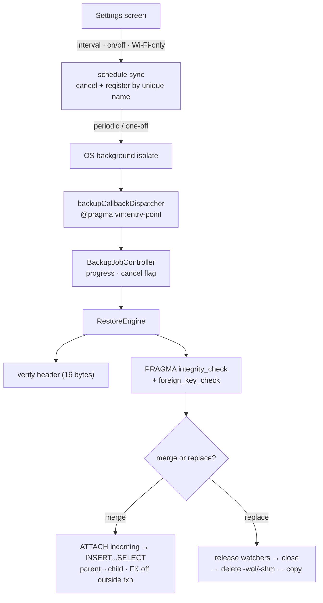

# Snippet — Auto-backup system

**A point-of-sale till that backs itself up on an OS schedule and restores a
verified database without ever leaving the WAL half-swapped.**

`Dart 3` · `Flutter` · `Drift (SQLite)` · `WorkManager` · offline-first

---

## The problem

A counter app is the system of record, but a phone is a hostile place to keep
the only copy: storage fills, the OS kills the app mid-write, a device is lost
or wiped. The business wants an optional, automatic copy in the cloud.

*Automatic* is where the difficulty lives:

- The work runs **when the app is not open** — scheduled by the OS, in a process
  the app never started and does not control, and which the operator must still
  be able to **stop** without leaving a changed schedule racing the old one.
- Restoring **replaces the live database**, which has open connections, stream
  watchers, and a write-ahead log. Do it in the wrong order and the file is
  corrupt — and the corruption only appears on next launch.
- A backup from a picked file or a cloud bucket is **untrusted input**: it may
  be truncated, from an older app, or not SQLite at all.

**The constraint:** the automatic path must be safe in a lifecycle the developer
does not control, and a restore must either land a verified file or leave the
existing one untouched.

## The mechanism

The settings screen mirrors itself into OS-scheduled work through unique names;
the OS spawns a fresh isolate that rebuilds its own database and job controller.
A single entry point dispatches by task name, so an auto backup and a
user-requested restore share one guarded lifecycle — and nothing touches the
live file until the candidate has been read and proven.



## The interesting part

### 1. Cancellable by checkpoints, not by killing threads

Dart gives no safe "abort this isolate" for work halfway through a database, so
cancellation is cooperative: every long step calls `checkCancelled()`, which
throws a `BackupCancelledException` at a point where the next write has not
begun, and polls `onCancelRequested` so a stop that originates at the platform,
not the UI, still surfaces. A cancel is **not an error** — it is swallowed and
reported as "stopped", so the OS does not retry a job deliberately halted.

### 2. The FK-off PRAGMA has to be outside the transaction

The merge copies parents before children, but it uses `INSERT OR REPLACE`, which
SQLite implements as *delete then insert*. With foreign keys on, replacing a
parent can cascade into deleting children copied earlier in the same pass.
Foreign keys must be off for the copy — and `PRAGMA foreign_keys` is a **silent
no-op inside a transaction**, so issuing it after `BEGIN` looks right and does
nothing. The pragma brackets the transaction, and `ATTACH` sits outside it too,
because SQLite refuses to attach inside a transaction:

```dart
await _db.customStatement("ATTACH DATABASE '$quoted' AS incoming");
try {
  await _db.customStatement('PRAGMA foreign_keys = OFF');
  return await _db.transaction(() => _copyTables(...));
} finally {
  await _db.customStatement('PRAGMA foreign_keys = ON');
  await _db.customStatement('DETACH DATABASE incoming');
}
```

Because the two schemas may have drifted, the copy names every column explicitly
instead of trusting `SELECT *`; column *sets* are compared first, and a table
whose shape does not match is reported as skipped, never force-fit:

```dart
final list = mainColumns.map((c) => '"$c"').join(', ');
await _db.customStatement(
  'INSERT $verb INTO main."$table" ($list) SELECT $list FROM incoming."$table"',
);
```

### 3. Full replace is a close-and-swap, and the sidecars go first

A merge can run beside the app; a **full replace cannot**, because the live file
is swapped out. The order is the whole problem. The candidate is verified while
the live connection still exists — a replace has no second chance — then the
watchers are released, the connection is closed, and only then is disk touched:

```dart
await verifyHeader(path);
await verifyIntegrity(path);          // while the live connection still exists
await releaseDatabase();              // cancel watchers, then close (with timeout)
for (final suffix in const ['', '-wal', '-shm', '-journal']) {
  final sidecar = File('$dbPath$suffix');
  if (await sidecar.exists()) await sidecar.delete();
}
await File(path).copy(dbPath);
```

Deleting the sidecars *before* the copy is the detail that matters. In WAL mode
the live database has `-wal` and `-shm` companions holding pages that were never
checkpointed into the main file. Copy a new main file over them and SQLite may
replay the **old** log over the **new** database on next open. Remove it, copy,
then let the next launch create fresh ones.

The header check rejects a JSON export or a half-downloaded archive without
opening a connection; `integrity_check` and `foreign_key_check` then run against
the candidate **attached as a side database**, so rows never enter the Dart heap —
catching a structurally sound file that would violate the app's references.

## Tradeoffs

- **Cooperative cancellation, not pre-emption.** A step that ignores
  `checkCancelled()` cannot be stopped, so checkpoints sit at table boundaries
  and before the file swap, where they are cheap and meaningful.
- **FK-safety by ordering *and* by disabling enforcement.** Ordering alone is
  not enough under `OR REPLACE`; disabling it trades a brief consistency gap for
  not cascading child deletes. The enclosing transaction restores both.
- **A full replace needs an app restart.** The connection is closed
  deliberately; re-opening the same path and expecting watchers to follow the
  swap is the half-open-handle failure this avoids.
- **Cloud backups are app-private snapshots pruned by count, not merged.**
  Keeping the newest N by modified time is simpler than reconciling versions.

## What this demonstrates

- **Background work as a first-class concern**: OS-scheduled isolates, unique
  names as cancellation handles, and outcome notifications.
- **SQLite lifecycle literacy**: WAL/SHM sidecars, connection release before a
  file swap, and the `foreign_keys`-in-a-transaction trap.
- **Verified, FK-safe ingestion of untrusted input**: explicit column mapping,
  ordered `INSERT ... SELECT`, and honest per-table skip reporting.

- [`code/backup_scheduler.dart`](code/backup_scheduler.dart) — OS registration, the isolate entry point, and task dispatch
- [`code/restore_engine.dart`](code/restore_engine.dart) — header and integrity verification, FK-safe merge, and the close-and-swap replace
- [`code/job_controller.dart`](code/job_controller.dart) — cooperative cancellation and progress/outcome notification
