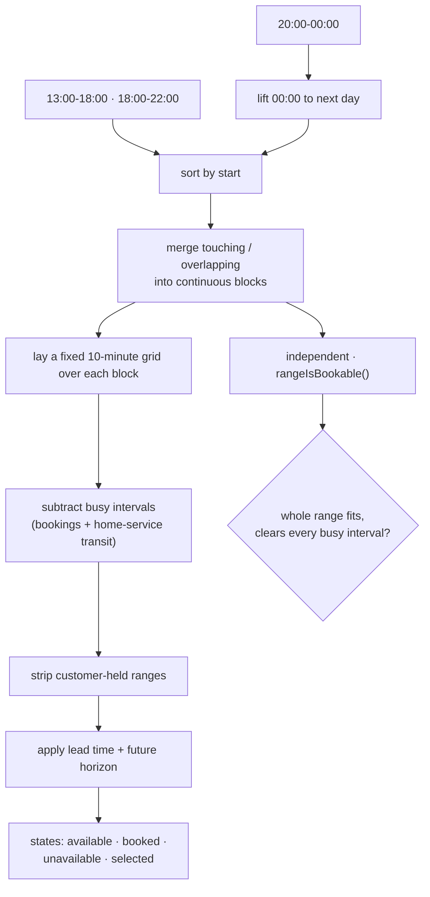

# Snippet — Availability engine

**Turning messy work schedules into bookable slots — and refusing to trust the slot grid when a real range is requested.**

`PHP 8.3` · `Laravel` · `CarbonImmutable` · interval algebra

---

## The problem

A services marketplace has to answer one deceptively simple question: *when can
this be booked?* Behind it sit three realities that do not agree.

First, **the roster is fragmented**. A provider's day is stored as rows — a
morning block, an afternoon block, a late block — and those blocks touch. A
booking must be allowed to straddle the seam between two of them, so they have
to be welded into continuous ranges first.

Second, **closing time is a lie**. A shift ending at midnight is stored as
`00:00`, which reads as the *start* of the day. Code that sorts the day naively
will silently drop a night block or place it before the morning.

Third, **the display and the rule are not the same thing**. The picker shows a
fixed 10-minute grid because humans like round numbers, but a request can begin
at `09:07` and run 50 minutes. The grid is a drawing; the booking rule is a
continuous interval check, so confusing the two lets the UI offer a slot the
server then refuses.

Add transit time between home visits, a minimum notice period, a furthest-ahead
horizon, and ranges already picked, and the "available slots" endpoint becomes a
small scheduling engine. The constraint: one source of truth for what is
bookable, with the grid allowed to *display* that truth but never decide it.

## The mechanism



The grid and the validator share the same merged blocks, the same busy
intervals, and the same lead/horizon policy — but the validator works on the
*actual* requested minutes, not on a row of 10-minute steps.

## The interesting part

### Midnight crossing and the seam

Fragments are turned into absolute instants, and a `00:00` close is lifted onto
the next day before anything is sorted or merged. Touching blocks join, so a
booking can span the boundary:

```php
foreach ($windows as $window) {
    $last = $merged[count($merged) - 1] ?? null;

    if ($last !== null && $window->start->lessThanOrEqualTo($last->end)) {
        // Touching or overlapping: keep the later close.
        if ($window->end->greaterThan($last->end)) {
            $merged[count($merged) - 1] = $last->stretchedTo($window->end);
        }

        continue;
    }

    $merged[] = $window;
}
```

The subtlety is `lessThanOrEqualTo`: blocks that *touch* (`13:00` end, `13:00`
start) form one continuous range, and merging them is what makes the seam
bookable. Comparison is on absolute Carbon instants, so a DST day that gains or
loses an hour is just a longer or shorter block rather than a special case.

### The grid is a drawing; the range check is the law

The grid steps in 10-minute increments and emits a slot at each step, including
the tail that no longer fits the block — that tail is the greyed-out edge of the
day the customer sees:

```php
for ($start = $block->start; $start->lessThan($block->end); $start = $start->addMinutes(self::GRID_STEP)) {
    $end = $start->addMinutes($serviceMinutes);

    if (! $block->contains($start, $end)) {
        // The service would spill past the close of this working block.
        return self::STATE_UNAVAILABLE;
    }
}
```

A slot's *start* is what the grid compares against busy ranges (one booking
starting inside another blocks that step), but the authoritative check asks
whether a whole range overlaps a whole range. That distinction is the
half-open interval test:

```php
// Half-open ranges: a booking that ends exactly when the next begins
// does not overlap, which is what lets back-to-back jobs coexist.
return $start->lessThan($otherEnd) && $otherStart->lessThan($end);
```

Get that `<` wrong by one and either back-to-back jobs become impossible or a
booking gets double-booked on its final minute. And because a request can begin
at any minute, `rangeIsBookable()` re-reads the merged blocks and busy intervals
directly rather than asking the grid — the grid could never approve `09:07`.
Home-service transit is handled in the same busy-interval set: a buffer is
appended *after* each booked job (the provider must travel before the next), but
never before the first, which is why the padding is asymmetric.

## Tradeoffs

- **Merging is recomputed per request.** Fragment sets are tiny and the merge is
  linear after a sort; caching it would be a correctness liability the day a
  roster edit changes the seam. Cheap-now, wrong-later is the right order.
- **The grid step is a single constant for every provider.** It is a display
  decision. If per-provider steps are ever needed, only the grid changes; the
  range rule already ignores it.
- **Busy intervals are supplied by the caller, not fetched here.** The engine is
  pure and clock-injected, so the algorithm is reviewable without a database.
- **Local wall-clock, not user timezone.** A location's schedule is archived in
  its own local time; converting to a browsing customer's timezone is a
  presentation concern one layer up, so the engine never mixes the two.
- **Lead time and horizon are enforced twice — for display and for the write.**
  The duplication is deliberate: the picker should grey out a slot *and* the
  write path should independently refuse it.

## What this demonstrates

- Reducing scheduling to **interval algebra**: lift, sort, merge, then test
  half-open ranges.
- Treating the **display grid and the validation rule as separate authorities**,
  so the UI can never grant what the server will deny.
- Getting the **boundary cases right**: midnight, touching seams, back-to-back
  bookings, DST-length days.
- Modelling **policy (transit, lead, horizon) as data** for a pure, clock-injected
  engine.
- Choosing **fail-loud validation** over a silent zero-length block.

- [`code/ScheduleWindow.php`](code/ScheduleWindow.php) — fragment merging and the midnight rule
- [`code/AvailabilityEngine.php`](code/AvailabilityEngine.php) — the slot grid, states, buffers, and range validation
