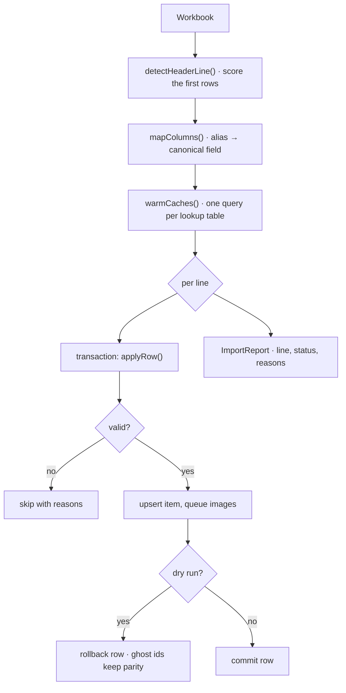

# Snippet — Bulk import

**A spreadsheet importer that assumes the file is wrong: it finds the header
itself, repairs the columns it can, fails per row instead of per file, and
reports every line it touched.**

`PHP 8.3` · `Laravel` · `PhpSpreadsheet` · queued jobs · per-row transactions

---

## The problem

Every supplier sends a product sheet, and no two are alike:

- The header is not on row one — an instructions banner sits above it.
- The same column is called `SKU`, `Item Code`, `Article No.`, `Reference`,
  `Artikelnummer` or `Código`, in different case, with accents and punctuation.
- Lookups (category, brand, tags) may already exist, or may need creating.
- Image links point at a dozen hosts, some slow or dead.

Two failure modes are unacceptable. A single bad row must not roll back the
other thousands, and an operator must preview the run before it touches the
database. Wrapping the whole file in one `DB::transaction` gives you neither:
one violation loses everything, and a "dry run" that merely skips writes
quietly diverges from the real run.

**The constraint:** operate per row, preview with *parity*, and say exactly what
happened on every line.

## The mechanism



Each line is its own transaction, so partial failure is contained. The dry run
executes the *same* `applyRow()` branch and rolls it back — not a separate
read-only path — which is what keeps the preview honest.

## The interesting part

### 1. Detect the header by score, not by position

Every candidate row is scored by how many cells resolve to a known field, and
the best row wins. All the naming mess is handled by folding the header to a
canonical key — lowercase, strip a BOM, translate accents, drop every
separator — then matching it against an alias table.

```php
foreach ($this->columnLetters($lastColumn) as $column) {
    if ($this->fieldFor($this->cell($sheet, $column, $line)) !== null) {
        $score++;
    }
}
```

### 2. A row is the unit of failure

Each row opens and closes its own transaction, so line 812 rolls back alone and
lines 1–811 stay. The catch is split from the commit deliberately: a **user**
validation error becomes a `skipped` row with reasons, a **programming** fault
becomes a `failed` row. Different audiences, different statuses.

```php
DB::beginTransaction();

try {
    $outcome = $this->applyRow($row);
} catch (Throwable $e) {
    DB::rollBack();
    $this->report->fail($line, $e, $row['sku'] ?? null);
    return;
}

$this->dryRun ? DB::rollBack() : DB::commit();
$this->report->record($line, $outcome['status'], $outcome['key'], $outcome['reasons'], $outcome['notes']);
```

### 3. Dry-run parity comes from shared code, not a shared flag

The preview calls the same `applyRow()`, resolves the same lookups, detects the
same duplicates. The only difference is that a missing lookup or a new item gets
a *negative synthetic id* recorded in the cache but never persisted:

```php
if ($this->dryRun) {
    return $cache[$key] = $this->ghostId();   // array_key_exists later sees "would exist"
}

return $cache[$key] = (int) $model::query()->firstOrCreate(['name' => $label])->getKey();
```

That one detail is why a duplicate *within the file* is reported the same way in
both modes: the second occurrence finds the ghost the first one left behind.

### 4. Images are a second, idempotent pipeline

Images are dispatched after the row commits, so a slow host cannot hold a
transaction open. Importer and job derive the same signature and the job refuses
an image the store already holds — a retry can only fill a gap, never duplicate.

```php
public static function signatureFor(string $url): string
{
    $name = strtolower(basename(parse_url($url, PHP_URL_PATH) ?: $url));
    $name = preg_replace('/-[0-9]+x[0-9]+(?=\.[a-z0-9]+$)/', '', $name) ?? $name;
    return sha1($name);
}

if ($store->hasImage($item, self::signatureFor($this->sourceUrl))) {
    return;   // already attached, by this attempt or an earlier one
}
```

The importer's pre-check is only a latency optimisation; the *safety* lives in the job, where retries also pass through it.

## Tradeoffs

- **A transaction per row commits more often** — the right trade for an import: correctness per line, a report that reflects what persisted.
- **Forgiving auto-create trusts the sheet.** Missing categories and brands are created on the fly, which is why invalid rows can be *marked inactive* rather than rejected — visible and correctable, never silently live.
- **Caches assume bounded lookup tables.** Categories, brands and tags are preloaded wholesale; millions of rows would need chunked warming. The item index is already the large one, keyed by SKU and name.
- **An image can trail its row.** A `created` row briefly has no image, which is declared, not hidden: the job logs a permanent failure only once its retries are exhausted.

## What this demonstrates

- Turning a hostile input format into a **stable internal contract** (canonical fields) instead of hard-coding column positions.
- Treating **partial failure** as normal: per-row transactions, collected skip reasons, a per-line account rather than one exit code.
- Making a **dry run run the real code** and roll back, so the preview cannot drift from the commit.
- **Idempotency under retries** in a background pipeline, via a signature both producer and consumer agree on.
- Watching **performance**: preloaded caches against N+1, progress callbacks, periodic memory release on large sheets.

- [`code/CatalogImporter.php`](code/CatalogImporter.php) — header detection, alias resolution, lookup caches, modes, per-row transactions, image dispatch
- [`code/ImageDownloadJob.php`](code/ImageDownloadJob.php) — the queued download with a shared dedup signature and retry-safe attach
- [`code/ImportReport.php`](code/ImportReport.php) — the row-by-row receipt DTO
