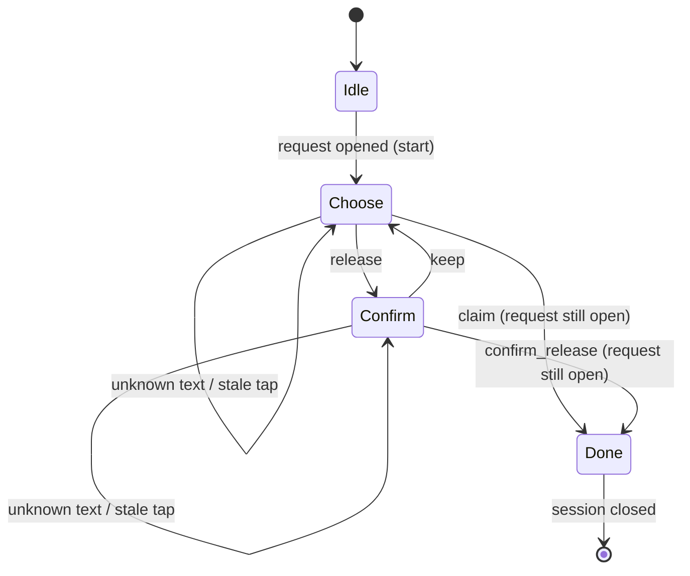

# Snippet — Conversation flow

**A signed, replay-safe state machine that turns a messaging webhook's messy
deliveries into exactly one conversation step.**

`PHP 8.3` · `Laravel` · `HMAC webhooks` · `cache-backed sessions` · `button /
list / text routing`

---

## The problem

A bot answers people over a messaging channel. Replies arrive by webhook, and a
webhook guarantees nothing:

- It is **unsigned until proven** — anyone who can reach the endpoint can post a
  body that looks exactly like a reply.
- It **repeats**. The provider retries until it sees a success, so the same tap
  can arrive three times.
- It **reorders**. A list selection can land after the prompt that offered it
  has already expired or been replaced.
- It **mixes shapes**. Button replies, list replies, plain text, and unsupported
  media all arrive down one endpoint, in one language-agnostic envelope.

A handler that ignores any of these produces the same class of bug: a side
effect applied twice, a state machine advanced by a tap meant for a step it has
already left, or a reply rendered in the wrong language. Nothing crashes; the
conversation just drifts.

**The constraint:** one authenticated delivery becomes exactly one transition —
or none.

## The mechanism

Two actors, with one responsibility each:

- **`WebhookReceiver`** is the edge. It verifies the signature, claims the
  delivery, resolves the sender, and fixes the language before anything else
  runs.
- **`ConversationRouter`** is the state. It keeps a small session per contact
  and routes each input to the flow and step that is waiting for it.



The whole session is three strings — `flow`, `step`, `subject` — kept in the
cache under the contact with a sliding TTL. An active conversation renews its
own lease; an abandoned one lapses without a cleanup job.

## The interesting part

### 1. Verify first, then claim — two different replays

The signature is checked over the raw body, in constant time, before any of it
is trusted. Only then is the delivery claimed with an atomic add:

```php
$expected = hash_hmac('sha256', $request->getContent(), $this->signingSecret);
return hash_equals($expected, $signature);              // never `===`
...
if (! Cache::add($delivery, true, now()->addHours(24))) {
    return;                                             // provider retried an identical body
}
```

A second `Cache::add` claims each *message id* too, because a retry can carry
the same id inside a body whose hash changed. Two layers, two kinds of duplicate
— and `add` is atomic, so there is no read-then-write window for two copies to
race through.

### 2. A tap only means something against the step that offered it

The router does not trust the input; it asks the current step whether the input
belongs to it. A stale button, or text where only a button fits, re-renders the
live prompt instead of advancing:

```php
if (! $flow->accepts($state, $input)) {
    $this->reRender($contact, $state);                  // stale input, re-offer
    return;
}

$next = $flow->advance($contact, $state, $input);
if ($next === null) { $this->close($contact); return; } // flow chose to end

$this->remember($contact, $next);
$flow->prompt($contact, $next);
```

This is what makes out-of-order delivery safe: a `confirm_release` that arrives
while the state is still `choose` is not a crash and not a wrong transition — it
is simply re-answered.

### 3. The domain write is the last idempotency net

Even if a duplicate slipped both cache layers, the transition re-reads the real
row and writes conditionally. The loser of a race changes zero rows:

```php
$claimed = Request::query()
    ->whereKey($request->id)
    ->where('status', RequestStatus::Open)              // only if still open
    ->update(['status' => RequestStatus::Accepted, 'owner_id' => $contact->id]);

if ($claimed === 0) { /* already resolved — acknowledge, do not re-apply */ }
```

### 4. Locale is data on the contact, not the process

The receiver resolves the language from the contact — `app()->setLocale($contact->locale ?? config('app.locale'))` — before a single string is composed, so one worker serving many senders renders each reply correctly. Unknown message types get a courteous reply and the live step is re-offered; a reply with no session behind it gets a reset rather than silence.

## Tradeoffs

- **Cache sessions, not database sessions.** Fast and self-expiring, but a cache
  flush or a deploy can drop a mid-conversation state; the sender re-triggers
  instead of resuming. State that must survive is a different design.
- **Dedupe keys expire after 24 hours.** Retries do not stretch that far, so it
  is a wide bound in practice, but it is a bound, not a proof.
- **Conditional write instead of a row lock.** Cheaper and returns `0` on the
  loser, which is exactly the signal we want; a non-transactional store could
  still interleave, so the write is the honest guard.
- **Re-render on unrecognised input.** Guessing an intent from free text would
  be friendlier and wrong more often; re-showing the menu is boring and correct.

## What this demonstrates

- Treating a webhook as **hostile input**: verify, claim, then act.
- **Idempotency as layers** — signature, delivery dedupe, message dedupe, and a
  conditional domain write — each catching a different duplicate.
- A **conversational state machine** that validates every input against its
  current step and closes cleanly.
- **Locale as per-contact data**, resolved at the edge.
- **Graceful fallbacks** for unknown shapes and expired sessions instead of
  exceptions.

**The code:**

- [`code/WebhookReceiver.php`](code/WebhookReceiver.php) — the untrusted edge: signature, replay, locale
- [`code/ConversationRouter.php`](code/ConversationRouter.php) — cache-backed session state and step routing
- [`code/IntakeFlow.php`](code/IntakeFlow.php) — one flow's prompts, transitions, and idempotent writes
