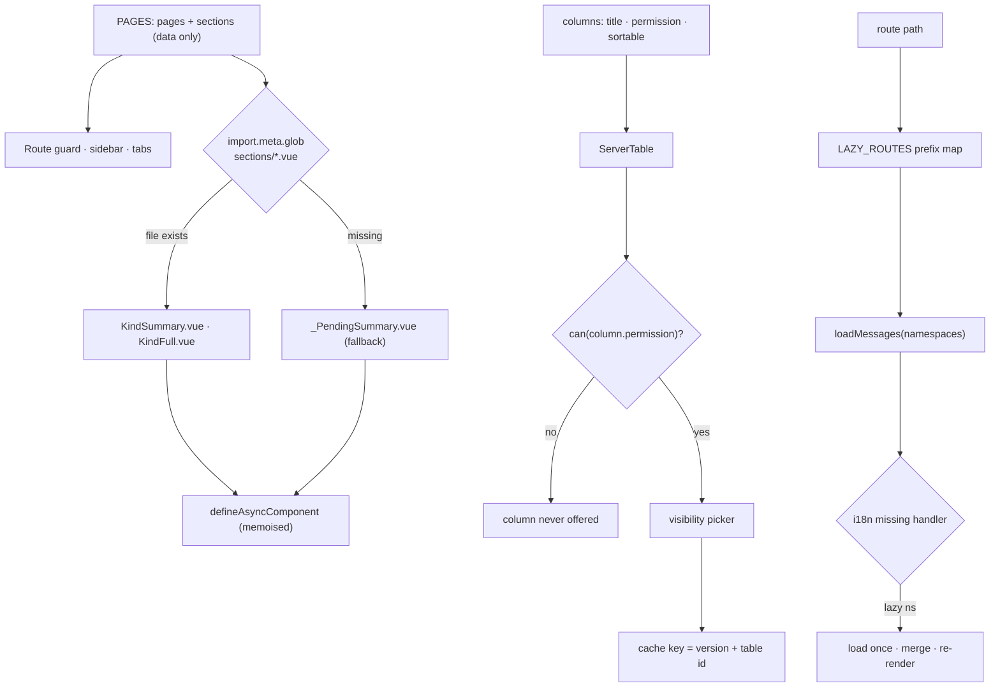

# Snippet — Dashboard component system

**Adding a page is a row in a registry, a section is a file, and a column is a
declaration — the router, the table and the text all learn it without new
wiring.**

`Vue 3` · `Nuxt` · `TypeScript` · `import.meta.glob` · `vue-i18n` · server-side tables

---

## The problem

An analytics dashboard grows in three directions at once, and each turns into
its own kind of entropy.

**Pages multiply.** Overview, operations, finance, growth, quality — each one a
handful of sections in a grid. Wired by hand, every page becomes a component
with its own imports, its own route and its own permission check, while the
sidebar, the tabs and the route guard each keep a second copy of the same list.

**Tables duplicate their own description.** A table knows its columns, but the
picker, the permission checks, the sort opt-in and the stored column choice each
re-implement that knowledge. A column added to the API but not to three other
places is either invisible or unguarded.

**Text loads too early, or blanks the page.** Shipping every feature's
translations in the entry bundle taxes the first paint; loading them lazily but
carelessly makes a heading flash its raw key before the chunk lands.

**The constraint:** a page should be *data*, a table described by its *columns*,
and a feature's text loaded once, before its route draws.

## The mechanism



Three modules, one idea each: the **registry** is data, the **table** is
column-driven, the **i18n loader** is a prefix map plus a safety net.

## The interesting part

### 1. Files resolve the kind; the kind never hard-codes a component

A page lists its sections by *kind* (`kpi`, `table`, `funnel`) and the registry
turns each kind into the component whose file exists right now — or a shared
pending pair when it does not. Adding a view is adding a file; a kind without a
full view simply keeps `full: null`.

```ts
const FILES = import.meta.glob('../components/dashboard/sections/*.vue') as Record<string, Loader>
const fileOf = (name: string): Loader | undefined => FILES[`../components/dashboard/sections/${name}.vue`]

export const KIND_COMPONENTS = Object.fromEntries(KINDS.map(kind => [kind, {
  summary: fileOf(`${kindFileName(kind)}Summary`) ?? fileOf('_PendingSummary')!,
  full: WITHOUT_FULL.includes(kind) ? null : (fileOf(`${kindFileName(kind)}Full`) ?? fileOf('_PendingFull')!),
}])) as Record<DashboardKind, { summary: Loader, full: Loader | null }>
```

Why a glob and not a handwritten map of imports: a map imports every section
eagerly the moment the registry is read, which is on every route. The glob keeps
each file its own chunk, and `defineAsyncComponent` is memoised so a re-render
rebuilds neither the loader nor the wrapper.

### 2. A stored column choice outlives a default change — so version the key

The picker stores the visible column keys per table in `localStorage`. That is
correct until the *default* changes: an account that once opened the table has a
stored choice that wins over the new default, so it never sees the change. The
fix is not to clear storage but to version it — and to *retire* the previous
generation rather than abandon it, or every browser keeps one dead entry per
table forever.

```ts
const COLUMN_CACHE_VERSION = 'v2'

const retireOldColumnCaches = () => {
  try {
    for (const key of Object.keys(localStorage)) {
      if (key.startsWith(COLUMN_CACHE_PREFIX) && !key.startsWith(`${COLUMN_CACHE_PREFIX}${COLUMN_CACHE_VERSION}-`))
        localStorage.removeItem(key)
    }
  } catch {}
}
```

The rest of the table falls out of the column list: `can(column.permission)`
decides whether a column is offered at all, and the sort opt-in keeps a
clickable header honest — the table sends `orderBy`/`sortBy`, and a table opts
in only once its endpoint really sorts.

### 3. Prefetch by route prefix, with a missing-handler safety net

A route path maps to the namespaces it needs; the guard asks for them before the
component draws. If a key is read before its chunk lands, the `missing` handler
returns an empty string instead of the raw key and starts the load — so the page
never flashes `dashboard.kpi.revenue` at a user.

```ts
export const lazyNamespacesFor = (path: string): LazyNamespace[] => [...new Set(Object.entries(LAZY_ROUTES)
  .filter(([prefix]) => path === prefix || path.startsWith(`${prefix}/`))
  .flatMap(([, names]) => names))]
```

## Tradeoffs

- **The glob is dynamic and therefore untyped.** `import.meta.glob` returns a
  record keyed by string; the `fileOf` helper and the `as` cast are the price of
  not maintaining one import per section. A missing file degrades to the pending
  view, not a crash.
- **A fallback pair is extra files.** `_PendingSummary.vue` and
  `_PendingFull.vue` exist so a half-built kind still renders — a deliberate trade.
- **Versioned caches need a cleanup, not just a bump.** Bumping the key alone
  leaves one dead entry per table per browser; the sweep is the part people
  forget.
- **Prefetching by prefix over-fetches on nested routes.** A deep path loads the
  whole feature's text; for these chunk sizes the simplicity wins, at the cost
  of a per-route manifest kept in sync.

## What this demonstrates

- **Data-driven UI at the page level.** Pages and sections are a list; the
  sidebar, the guard and the tabs are all views of it, and a glob plus a
  file-name convention lets the filesystem be the registry.
- **Self-describing components.** The table derives its picker, its permission
  gate and its sort behaviour from the columns it is handed.
- **Cache migrations done properly.** A versioned key *and* a retirement sweep,
  so a default change actually reaches the accounts it is meant for.
- **Lazy text that cannot flash keys.** A prefix map for prefetch and a missing
  handler that degrades to empty, never to the raw key.

- [`code/dashboardRegistry.ts`](code/dashboardRegistry.ts) — pages as data, kinds resolved by glob, memoised async components
- [`code/ServerTable.vue`](code/ServerTable.vue) — column-driven server table, permission-gated columns, versioned visibility cache
- [`code/lazyI18n.ts`](code/lazyI18n.ts) — per-route namespace prefetch and the missing-key safety net
