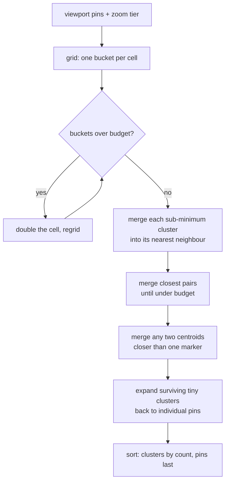

# Snippet — Map clusterer

**Folds a viewport of pins into a bounded, zoom-appropriate set of clusters —
by grid, then by proximity — and expands the few too small to be worth
drawing.**

`PHP 8.3` · `Laravel` · zoom-tiered grid clustering · centroid merging

---

## The problem

A map can hold tens of thousands of markers. Sending them all is a large
payload and a slow render, and a thumbnail showing every pin is unreadable. So
the server reduces them — and the obvious reduction, one cluster per grid
cell, leaves three artifacts a viewer notices immediately:

- cells that render as **clusters of one**, which look like a pin that lost its
  label;
- two clusters that **overlap on screen**, because the grid knows nothing about
  how wide a marker is;
- a **fixed cell size** that under-clusters a dense city and over-clusters an
  empty desert.

The constraint is to satisfy four goals that pull against each other: stay
under a hard **item budget**, keep markers from **touching at this zoom**,
never show a **meaningless cluster**, and stay cheap enough to **render as
thumbnails**. Correctness wants many small truthful clusters; performance
wants few large cheap ones.

## The mechanism



Each pass repairs the artifact the previous one can leave:

1. **Grid** — O(n) bucket by a cell sized to the zoom and the budget.
2. **Grow** — double the cell and regrid while the count is over budget.
3. **Floor** — a cell with one or two pins is not a cluster; fold it into its
   nearest neighbour.
4. **Cap** — merge the closest pair repeatedly until the budget holds.
5. **Separate** — merge any pair whose centroids are closer than one marker.
6. **Expand** — whatever is still below the minimum goes back to raw pins.

## The interesting part

The separation pass is what makes the output *look* right, and it is also the
loop condition that is easy to get wrong. The nearest pair is recomputed after
every merge, and once that pair is far enough apart, every other pair is too:

```php
for ($pass = 0, $limit = count($clusters) * 2; $pass < $limit; $pass++) {
    $pair = $this->closestPair($clusters);

    if ($pair === null) {
        break;
    }

    [$first, $second] = $pair;

    if (ClusterMath::distance($clusters[$first], $clusters[$second]) >= $minSeparation) {
        break; // the nearest pair is clear, so all pairs are clear
    }

    $clusters[$first] = $this->mergeTwo($clusters[$first], $clusters[$second], $zoom, $layer, "sep_{$pass}_{$first}_{$second}");
    unset($clusters[$second]);
    $clusters = array_values($clusters);
}
```

Nothing here is hard line by line; what is hard is the interaction:

- **Zoom buckets.** A cell is `360 / (256 · 2^z)` degrees times the tier's
  radius, so the same data clusters very differently at z4 and z14. The
  minimum separation is that same formula expressed in marker pixels, which is
  why a cluster built at one zoom is meaningless at another and must be free
  to re-form rather than cached across zooms.
- **Centroid merging.** A merged cluster is the **count-weighted** centroid of
  its members, not the midpoint, or a big cluster would visibly drift toward
  the small one it absorbed. Merging also concatenates the member lists, so a
  later expansion can still recover every original pin.
- **Dateline and poles.** A viewport with `west > east` crosses the
  antimeridian; measuring it as `east - west` would size the grid for the
  whole planet, so `longitudeSpan()` takes the short way around. Grid bucketing
  is still discontinuous at ±180 and at the poles, where a lone pin can occupy
  its own cell — the merging passes are what stop that from becoming a stray
  one-pin cluster. (Distances are Euclidean in degrees; see below.)

## Tradeoffs

- **Euclidean degrees, not haversine.** Two pins 0.1° apart are treated as the
  same distance north–south as east–west, and a degree of longitude shrinks
  toward the poles. For a thumbnail this is invisible and much cheaper; a
  geodetic distance is the first change for anything route-accurate.
- **O(n²) closest-pair.** The cap and separation passes rescan all pairs after
  each merge. That is fine because the grid pass has already reduced the set to
  near the budget; a spatial index earns its keep only at budgets far above a
  thumbnail.
- **Doubling can overshoot.** Cell growth halves the cluster count
  geometrically, so it can land well under budget and then hide pins inside
  large clusters. The minimum-merge and expansion passes are the counterweight.
- **Expansion re-inflates the count.** Turning a tiny cluster back into pins
  can push the result over budget — deliberately: the budget bounds the
  *grid*, while expansion restores truthfulness. The final sort puts clusters
  first so any downstream truncation keeps the important ones.

## What this demonstrates

- A **multi-pass reduction** where each pass owns one failure mode, instead of
  one clever loop that hides all of them.
- **Performance treated as a budget**: the cap, the cell growth, and the
  thumbnail-first ordering are explicit, named choices, not accidents.
- **Edge-case awareness** at the antimeridian and the poles, plus the honesty
  to name the approximation (degrees, not metres) rather than bury it.
- A clean split between the **algorithm** and its **geometry**, so the
  distance metric is one file to change.

- [`code/GridClusterer.php`](code/GridClusterer.php) — the grid, growth, merge,
  expand, and sort passes.
- [`code/ClusterMath.php`](code/ClusterMath.php) — cell sizing, centroids, and
  the dateline-aware span.
