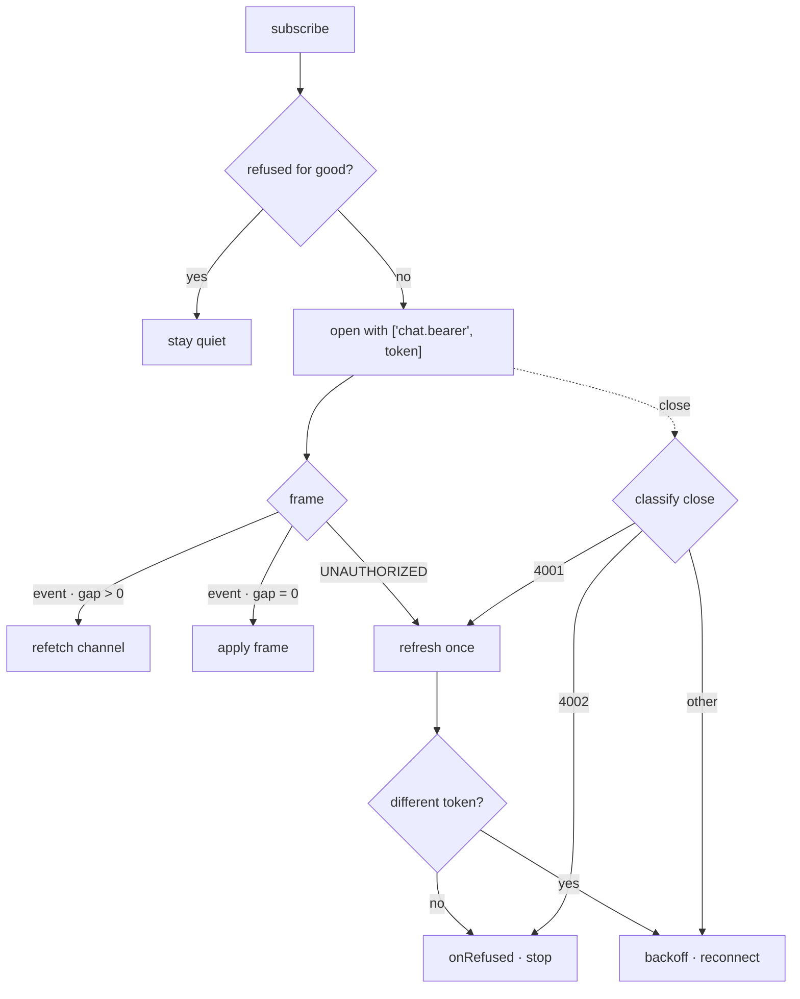

# Snippet — Realtime gateway

**One tab-scoped WebSocket that treats a dropped frame as a reason to refetch
and a refused token as a reason to stop.**

`TypeScript` · `Node` · `WebSocket` · browser subprotocol auth · injectable transport

---

## The problem

A chat-and-presence UI wants live updates, so it holds one socket per tab and
subscribes to a handful of channels. Four details make that harder than it looks.

**A browser cannot set a header on a WebSocket.** The handshake that carries
`Authorization: Bearer …` from an HTTP client has no such affordance here, and a
missing credential is refused *after* `onopen` — so "the socket opened" says
nothing about whether it was accepted. Only the close code does.

**One close code means two opposite things.** `4001` arrives both when the
server rejects a credential and when a healthy socket's access token merely ages
out under the server's heartbeat. Reconnect on the first and the tab retries the
same "no" forever; do not reconnect on the second and realtime dies fifteen
minutes into every session.

**A dropped frame is invisible.** The server numbers every frame per channel,
but if the client ignores the number, a lost frame just leaves stale state on
screen until something unrelated happens to refetch.

**Reconnects are not free.** Every subscription must be replayed, retries must
back off, and a teardown must actually stop the loop.

**The constraint:** tell "refused" from "dropped" from "aged out" without knowing
how sessions work.

## The mechanism



## The interesting part

### 1. The token is the protocol, so the server re-reads it on every close

The credential can only travel in the subprotocol list, so the marker and the
token beside it are the whole handshake:

```ts
this.attach(factory(this.options.url, [BEARER_SUBPROTOCOL, token]));
```

Nothing is stored on the socket: after a refusal the gateway compares that token
with the one a refresh produced, using only the string it already held.

### 2. A refusal is told apart by the credential, not by the close code

This is the hard part. `4001` is not a verdict; it is a question. So a `4001`
asks the provider for a *different* token, and reconnects only if it gets one:

```ts
const refused = this.presentedToken;
this.resolveCredential(true, (fresh) => {
	// Same token, or none: there is no better credential to present, and
	// reconnecting would replay the same refusal forever. Stop.
	if (fresh === null || fresh === refused) {
		this.refuse(CLOSE_UNAUTHORIZED);
		return;
	}
	this.presentedToken = fresh;
	this.pendingToken = fresh;
	this.scheduleReconnect();
});
```

`4002` needs no such reasoning: another connection must close first, so it is
terminal the moment it is classified. A refresh is also **single-flight** —
two sockets can be refused at nearly the same moment, and they must share one
refresh or the provider rotates the credential twice and the second socket
presents a token the first already spent.

### 3. A gap forces a refetch; it never patches stale state

The server's counter is monotonic per channel, so the distance between two
observed values is exactly the number of frames that never arrived. When that
number is positive, the missing frames are the ones that would have explained
*why* the frame in hand is valid — so the handler refetches instead:

```ts
observe(channel: string, seq: number): number {
	const previous = this.last.get(channel);
	this.last.set(channel, seq);

	if (previous === undefined || seq <= previous) {
		return 0;
	}
	return seq - previous - 1;
}
```

Two cases deliberately return `0`. The first frame after a (re)connect is not a
gap — the server's counter does not restart with the socket, so the distance
from a previous socket's last `seq` is not a run this client can act on. A
duplicate or out-of-order frame is not a gap either; it is one to ignore.

## Tradeoffs

- **`4001` costs one refresh round trip even when the answer is "no".** The
  price of not teaching the gateway about sessions. A separate "signed out"
  signal would be a second source of truth that drifts.
- **The tracker is in memory and cleared on reconnect, deliberately.** A stale
  `seq` surviving a tab reload would report a gap nobody can act on; the counter
  is meaningful only within one socket's life.
- **Single-flight refresh holds a promise, not a queue.** Concurrent refusals
  share the in-flight result; one landing after it resolves starts a new
  refresh. For a token with one logical owner, that is the right boundary.
- **The gateway never retries a terminal refusal.** Recovery is the caller's job
  — sign in, close the other tab, subscribe again, which clears the state on
  teardown. Silently retrying a permanent "no" is the bug this prevents.

## What this demonstrates

- **Protocol design at the transport edge.** Solving the "no headers on a
  WebSocket" constraint with subprotocols, keeping the credential off the socket.
- **Turning an ambiguous signal into a decision.** One close code, two meanings,
  told apart by the credential the gateway itself controls.
- **Correctness over freshness.** A gap is a refetch trigger, never a patch onto
  state already missing predecessors.
- **Concurrency discipline, tested by construction.** A single-flight refresh,
  a teardown that cancels pending work, and injected transport / scheduler /
  credential so connect / refuse / reconnect run with no network.

- [`code/protocol.ts`](code/protocol.ts) — frames, close-code taxonomy, and the injectable seams
- [`code/sequence-tracker.ts`](code/sequence-tracker.ts) — per-channel sequence state and gap detection
- [`code/gateway.ts`](code/gateway.ts) — the connect / refuse / reconnect state machine
