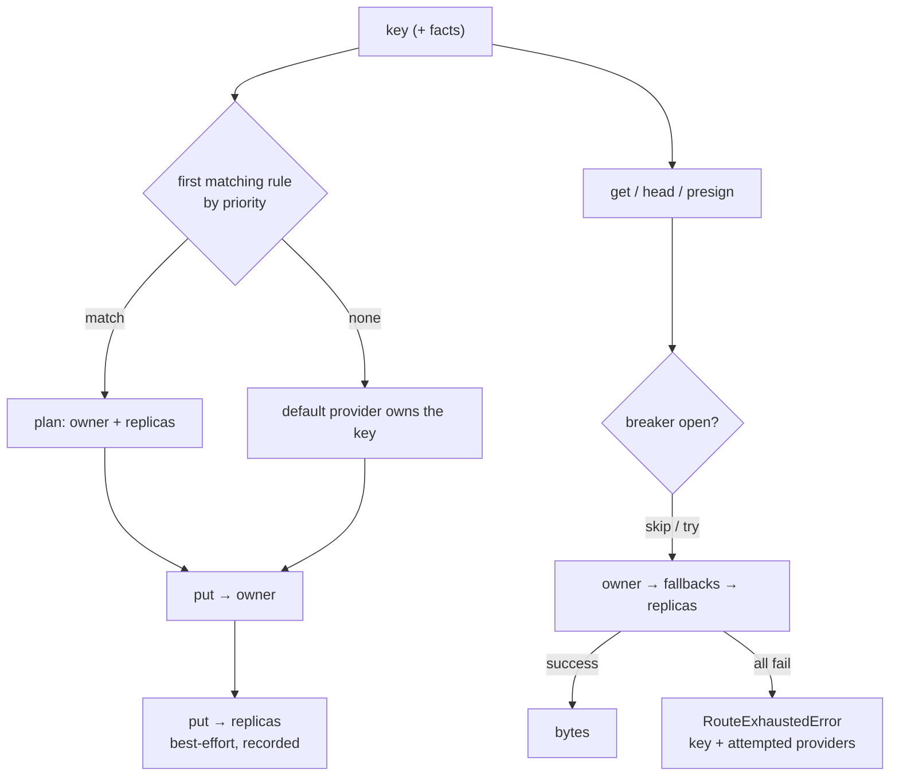

# Snippet — Storage router

**One policy decides where every object lives; reads fail over to a replica and
writes never quietly land outside their policy.**

`TypeScript` · `Node` · provider-agnostic object storage

---

## The problem

Object storage stops being one place the moment a product has opinions: hot
assets want the fast tier, archives want the cheap tier, durability wants a
second copy elsewhere. The first version branches on the key at every call site,
and every new rule must be remembered in every upload, download, copy, and delete.

The dangerous failure is not a crash. A write that fails over to a second
provider while reads still follow the first leaves an object that **exists and
is invisible at once** — the upload reported success, every future read says it
is missing. A delete that reaches only one copy is the reverse: a tombstone a
later failed-over read resurrects.

**The constraint:** one policy, applied consistently to every operation, with
failover that is safe *because* it is limited to reads, and no vendor SDK
leaking into application code.

## The mechanism

A key is matched against priority-ordered rules. The winning rule names an
**owner** and any **replicas**. Reads walk owner → fallbacks → replicas,
skipping providers whose circuit breaker is open. Writes go to the owner, then
replicate; if the owner fails, the write fails too.



## The interesting part

### 1. Reads fail over; writes do not — and that is the whole design

Failover is safe for a read because the operation is idempotent and harmless
wherever the bytes come from. For a write it is a correctness bug: the fallback
provider is not where the policy says the object lives, so the next read will
not find it. The loop is trivial; choosing what may retry is not.

```ts
async get(key: ObjectKey, options?: GetOptions): Promise<ObjectBody> {
  for (const provider of this.candidates(plan)) {   // owner → fallbacks → replicas
    try { const body = await provider.get(key, options); this.noteSuccess(provider.id); return body }
    catch (error) { this.noteFailure(provider.id); causes.push(error) }
  }
  throw new RouteExhaustedError(key, attempted, causes)
}

async put(key: ObjectKey, body: ObjectBody, options?: PutOptions): Promise<ObjectLocation> {
  const owner = this.providers.get(plan.owner)!
  try { location = await owner.put(key, payload, options) }
  catch (error) { this.noteFailure(owner.id); throw error }   // no silent failover
  await this.replicate(key, payload, options, plan)
  return location
}
```

### 2. Delete is a fan-out, because failover can resurrect

If a read can fall back to a replica, a delete that reaches only the owner
leaves a copy behind — and the next failed-over read brings the object back.
The fan-out over *every configured provider* is the tombstone, and it throws
when any copy could not be removed so the caller knows the delete is incomplete.

```ts
await Promise.all([...this.providers.values()].map(async (provider) => {
  try { await provider.delete(key); this.noteSuccess(provider.id) }
  catch (error) { this.noteFailure(provider.id); causes.push(error) }
}))
if (causes.length > 0) throw new RouteExhaustedError(key, attempted, causes)
```

### 3. The breaker has a floor, so a slow mesh is not a black hole

Tripped providers are skipped to avoid hammering a struggling backend. But if
every candidate is tripped, skipping all of them would turn degradation into a
total outage, so the router probes the full order instead:

```ts
const reachable = ordered.filter((id) => !this.isTripped(id))
return reachable.length > 0 ? reachable : ordered
```

`health()` reports two distinct states: **healthy** means the default provider
can take writes; **degraded** means that is still true while a tracked fallback
or replica is down, so reads succeed but durability has narrowed.

## Tradeoffs

- **Consistency.** Replicas are best-effort and eventually consistent, so a
  read that falls back can serve a slightly older copy; there is no
  read-your-writes guarantee across providers.
- **Latency.** Replication sits on the write path after the owner commits, so a
  put pays for the slowest replica. I kept it synchronous-but-fault-tolerant and
  reported the degradation in `health()` rather than acknowledge a write whose
  durability is unknown.
- **Cost.** Every replicated write duplicates bytes, and delete and list are
  per-provider. Replication is opt-in per rule, so archive-tier objects skip it.
- **Streaming.** Replication forces a one-shot stream to be buffered once, so
  very large uploads cap memory and throughput instead of streaming through.
- **Listing is not merged.** The owner answers the prefix; merging replicas
  would double-count one logical object.

## What this demonstrates

- Turning "which store does this key live in?" from scattered conditionals into
  a **priority-ordered policy** applied identically to every operation.
- Distinguishing **safe failover (reads) from unsafe failover (writes)** and
  choosing loud failure over a silent split brain.
- Treating **replication and deletion as one decision**, so failover cannot
  resurrect deleted data.
- **Circuit breaking with a floor**, and health aggregation that separates
  *healthy* from *degraded* instead of collapsing them.
- A **provider contract that hides paths, buckets, endpoints, and signing
  schemes**, so a store can be replaced without touching the policy.

- [`code/provider.contract.ts`](code/provider.contract.ts) — the provider
  interface (`put`/`get`/`delete`/`head`/`list`/`copy`/`move`/`presign`) and the
  routing fact and rule types.
- [`code/storage-router.ts`](code/storage-router.ts) — priority selection,
  replication, read-side failover, the circuit breaker, and health aggregation.
